<div align="center">


# MissionChief Map Command Toolkit

**Turn the MissionChief map into a complete operational command centre.**

Mission intelligence · Fleet awareness · Map utilities · Responsive controls · Cinematic themes · Verified releases

[](https://update.greasyfork.org/scripts/586018/MissionChief%20Map%20Command%20Toolkit.user.js)
[](https://conroy1988.github.io/missionchief-toolkit-assets/)
[](https://github.com/Conroy1988/missionchief-toolkit-assets/releases)

[](https://github.com/Conroy1988/missionchief-toolkit-assets/releases/latest)
[](https://greasyfork.org/en/scripts/586018-missionchief-map-command-toolkit)
[](https://greasyfork.org/en/scripts/586018-missionchief-map-command-toolkit)
[](https://github.com/Conroy1988/missionchief-toolkit-assets/actions/workflows/validate-userscript.yml)
[](https://github.com/Conroy1988/missionchief-toolkit-assets/actions/workflows/full-userscript-audit.yml)
[](#licence-and-attribution)

[Documentation](https://conroy1988.github.io/missionchief-toolkit-assets/) · [Feature ideas](https://github.com/Conroy1988/missionchief-toolkit-assets/discussions/categories/feature-ideas) · [Help and troubleshooting](https://github.com/Conroy1988/missionchief-toolkit-assets/discussions/categories/help-and-troubleshooting) · [Report a confirmed bug](https://github.com/Conroy1988/missionchief-toolkit-assets/issues/new) · [Public roadmap](https://github.com/users/Conroy1988/projects)

</div>

---

## The command centre MissionChief should have

MissionChief Map Command Toolkit is a single configurable userscript that adds a serious operational layer to the game map. It keeps missions, vehicles, transport demand, alliance value, geographic coverage and critical incidents readable without forcing the player to jump between disconnected screens.

The Toolkit is designed for busy accounts and large alliances where the standard map can become difficult to interpret. Every system can be enabled independently, every major panel has responsive behaviour, and settings can be exported between devices.

<table>
<tr>
<td width="25%" align="center"><strong>🚨 Mission intelligence</strong><br><sub>Age, severity, clearing state, transport demand and rapid incident navigation.</sub></td>
<td width="25%" align="center"><strong>🚓 Fleet awareness</strong><br><sub>Vehicle codes, availability, hidden vehicle batches and operational focus controls.</sub></td>
<td width="25%" align="center"><strong>🗺️ Map operations</strong><br><sub>Coverage heat maps, bookmarks, rings, overlays and responsive map-space management.</sub></td>
<td width="25%" align="center"><strong>✨ Presentation</strong><br><sub>Complete interface themes, payout sequences, audio, alerts and completion history.</sub></td>
</tr>
</table>

## Operational systems

| System | Operational value |
|---|---|
| **Mission Age Watch** | Sorts and surfaces personal missions by age, urgency, assistance state and clearing progress. |
| **Critical View** | Creates a concentrated workflow for missions that need immediate attention. |
| **Mission Inspector** | Opens deeper mission context only when requested, avoiding unnecessary startup work. |
| **Major Incident Feed** | Presents high-priority incidents in a live top-bar feed with click-to-zoom navigation. |
| **Vehicle Code Status** | Summarises the live fleet by response code, description and count. |
| **Transport Watcher** | Identifies missions that still require patient transport and shows current demand. |
| **Auto-load all vehicles** | Activates MissionChief's native hidden-vehicle batch control when enabled. |
| **Alliance Credits** | Adds compact mission values, eligibility-aware colouring and value filters. |
| **Coverage Heat Map** | Visualises operational coverage directly on the Leaflet map. |
| **Smart Bookmark Labels** | Produces readable compact place labels with manual overrides and touch previews. |
| **Financial intelligence** | Summarises income, spending and net position with Discord-ready reporting. |
| **Settings import/export** | Moves the complete Toolkit configuration between desktop, tablet and iOS. |

<details>
<summary><strong>View the complete capability breakdown</strong></summary>

### Mission command

- Personal and alliance mission visibility controls
- Mission Age Watch with progress synchronisation
- Critical mission workflow and clearing-state tracking
- Patient and transport monitoring
- Mission Inspector and rapid map navigation
- Major Incident Feed with postcode and incident context
- Alliance payout overlays and completion history

### Fleet and transport

- Vehicle Code Status panel and keyboard shortcut
- Transport demand counts
- Unit-count overlays
- Focus Mode and visibility controls
- Automatic loading of MissionChief's limited vehicle-list batches
- Rapid navigation to active units and incidents

### Map operations

- Coverage heat maps and coverage rings
- Landmark bookmarks and quick jumps
- Smart short labels with long-press previews on touch devices
- Day, night and themed map presentation
- Alliance Buildings map suppression for performance-sensitive pages
- Desktop, tablet and iOS-safe map placement

### Finance and presentation

- Daily, weekly and monthly financial summaries
- Alliance value filters and eligibility state
- Smooth mission-payout counters
- Configurable completion duration and emergency flash
- Hosted audio and transparent visual assets
- Persistent completion history

</details>

## Hyrule Command — the flagship theme

<table>
<tr>
<td width="25%" align="center"><br><strong>Royal command identity</strong></td>
<td width="25%" align="center"><br><strong>Ancient-blue telemetry</strong></td>
<td width="25%" align="center"><br><strong>Energy-state animation</strong></td>
<td width="25%" align="center"><br><strong>Quest Reward payout</strong></td>
</tr>
</table>

**Hyrule Command** combines temple stone, royal gold, parchment cartography, ancient-blue illumination and luminous green energy into a complete command interface. It includes its own transparent asset suite and the **Hyrule Quest Reward** mission-completion sequence.

The Toolkit also includes:

| Theme | Character |
|---|---|
| **Map Command** | Restrained, high-contrast operational command interface. |
| **Cyberpunk** | Neon telemetry, angular panels and warning-yellow signal language. |
| **Fallout 4** | Phosphor terminal styling and industrial Pip-Boy presentation. |
| **Umbrella Containment** | Clinical black, white and red containment-system interface. |
| **Factorio** | Heavy machinery, amber controls and industrial status panels. |
| **Hyrule Command** | Parchment maps, royal gold, ancient runes and cinematic quest rewards. |

Inactive themes do not perform theme-specific runtime work. Economy Mode and reduced-motion preferences keep the interface readable while suppressing non-essential effects.

## Install

### Recommended installation

1. Install a userscript manager such as **Tampermonkey**.
2. Open the verified installation link:

   **[Install MissionChief Map Command Toolkit](https://update.greasyfork.org/scripts/586018/MissionChief%20Map%20Command%20Toolkit.user.js)**

3. Confirm the userscript installation.
4. Reload MissionChief and click the Toolkit map-command button.
5. Enable only the systems required for the current account and device.

> [!NOTE]
> Greasy Fork is the supported public installation and automatic-update route. GitHub is the canonical source, validation authority and release archive.

### Public distribution links

- [Greasy Fork information page](https://greasyfork.org/en/scripts/586018-missionchief-map-command-toolkit)
- [Greasy Fork version history](https://greasyfork.org/en/scripts/586018-missionchief-map-command-toolkit/versions)
- [Latest immutable GitHub Release](https://github.com/Conroy1988/missionchief-toolkit-assets/releases/latest)
- [Canonical changelog](CHANGELOG.md)

## Desktop, tablet and iOS

| Operating mode | Designed for | Behaviour |
|---|---|---|
| **Desktop** | Full browser map and large displays | Complete panels, keyboard shortcuts and expanded monitoring. |
| **Tablet** | Landscape tablet layouts | Space-aware controls without unnecessary panel scrolling. |
| **iOS Mobile** | Safari with a compatible userscript manager | Touch-safe controls, compact panels and long-press bookmark previews. |
| **Economy Mode** | Performance-sensitive devices or sessions | Static presentation, reduced animation and lower visual overhead. |

The same persisted settings schema is used across modes, and the import/export tools provide a portable configuration backup.

## Keyboard command layer

| Key | Action |
|---:|---|
| `1` | Toggle My Missions |
| `2` | Toggle Alliance Missions |
| `3` | Toggle Vehicles |
| `4` | Toggle My Buildings |
| `5` | Toggle Alliance Credits |
| `6` | Toggle Mission Age Watch |
| `V` | Open or close Vehicle Code Status |

Shortcuts are ignored while typing into form controls.

## Verified release engineering

The public userscript is not copied manually between services. Every formal release moves through a guarded pipeline:

```mermaid
flowchart LR
    A[Canonical source] --> B[PR validation]
    B --> C[Deep audit and integrity gates]
    C --> D[Merge to main]
    D --> E[Release readiness]
    E --> F[Immutable GitHub Release]
    F --> G[Greasy Fork synchronisation]
    G --> H[Live version verification]
    H --> I[Private release backup]
    I --> J[Discord release announcement]
    J --> K[Dashboard and recovery record]
```



A Discord release announcement is sent only after the live Greasy Fork version and the private backup have both been verified.

### Current release state

| Source | Live record |
|---|---|
| Human-readable control panel | [`status/README.md`](status/README.md) |
| Machine-readable dashboard | [`status/release-dashboard.json`](status/release-dashboard.json) |
| Latest immutable release | [GitHub Releases](https://github.com/Conroy1988/missionchief-toolkit-assets/releases/latest) |
| Public update channel | [Greasy Fork](https://greasyfork.org/en/scripts/586018-missionchief-map-command-toolkit) |

## Development path

Routine delivery follows one predictable route:

```text
Create focused branch
        ↓
Commit complete source and documentation
        ↓
Open one pull request
        ↓
Run targeted validation and audit gates
        ↓
Merge the reviewed candidate
        ↓
Run release readiness
        ↓
/release-toolkit X.Y.Z RELEASE
```

The owner-authorised release command dispatches the permanent production workflow. Temporary release workflows and dummy trigger commits are not part of the supported process.

### Repository map

```text
src/                Canonical userscript source
 dist/              Byte-identical validated distribution
 themes/            Stable theme-specific visual and audio assets
 docs/               Documentation, media and GitHub Pages source
 status/             Human-readable and machine-readable release state
 .github/scripts/    Validation, audit, build and release tooling
 .github/workflows/  Permanent automation only
```

## Compatibility and safety principles

- **Behaviour before cleanup:** code is removed only when call-path and state-effect evidence prove it is dead.
- **Stable settings:** existing localStorage keys and import/export data remain compatible.
- **Stable assets:** public image and audio paths are not renamed or removed without a migration route.
- **Targeted automation:** workflows run only when their inputs or protected responsibilities change.
- **No premature releases:** GitHub, Greasy Fork, private backup and Discord records must agree.
- **Recoverability:** formal releases include checksums, manifests and an immutable archive.

## Community and support

| Route | Use it for |
|---|---|
| [Help and troubleshooting](https://github.com/Conroy1988/missionchief-toolkit-assets/discussions/categories/help-and-troubleshooting) | Installation, settings and usage questions. |
| [Feature ideas](https://github.com/Conroy1988/missionchief-toolkit-assets/discussions/categories/feature-ideas) | Early proposals and community discussion. |
| [Show and tell](https://github.com/Conroy1988/missionchief-toolkit-assets/discussions/categories/show-and-tell) | Layouts, themes and operational setups. |
| [GitHub Issues](https://github.com/Conroy1988/missionchief-toolkit-assets/issues) | Confirmed bugs, performance regressions and actionable specifications. |
| [Public roadmap](https://github.com/users/Conroy1988/projects) | Current investigation, development and release state. |

## Licence and attribution

MissionChief Map Command Toolkit is maintained by **Conroy1988** and distributed under the [MIT licence](LICENSE).

MissionChief trademarks, game content and referenced third-party material remain the property of their respective owners. This is an independent community userscript and is not an official MissionChief product.

---

<div align="center">

<strong>MissionChief Map Command Toolkit</strong><br>
<sub>Operational intelligence · Responsive command · Verified delivery</sub>

</div>
