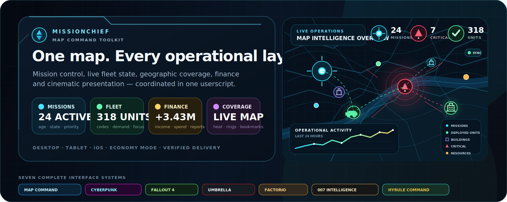

<div align="center">



# MissionChief Map Command Toolkit

### Turn the MissionChief map into a live operations console

**Mission intelligence · Specialist fleet identity · Geographic command · Financial reconciliation · Seven interface systems · Desktop, tablet and iOS**

[](https://update.greasyfork.org/scripts/586018/MissionChief%20Map%20Command%20Toolkit.user.js)
[](https://conroy1988.github.io/missionchief-toolkit-assets/)
[](https://conroy1988.github.io/missionchief-toolkit-assets/themes/)

**Current verified release: `v4.20.33`**

[](https://github.com/Conroy1988/missionchief-toolkit-assets/releases/latest)
[](https://greasyfork.org/en/scripts/586018-missionchief-map-command-toolkit)
[](https://greasyfork.org/en/scripts/586018-missionchief-map-command-toolkit)
[](https://github.com/Conroy1988/missionchief-toolkit-assets/stargazers)
[](https://github.com/Conroy1988/missionchief-toolkit-assets/actions/workflows/validate-userscript.yml)
[](https://github.com/Conroy1988/missionchief-toolkit-assets/actions/workflows/full-userscript-audit.yml)
[](#licence-and-attribution)

[**Mission briefing**](#mission-briefing) · [**Install**](#install-in-under-a-minute) · [**Current release**](#current-production-line) · [**Command systems**](#operational-command-systems) · [**Interfaces**](#seven-complete-interface-systems) · [**Devices**](#built-for-every-screen) · [**Release integrity**](#verified-delivery-and-recovery) · [**Support**](#support-and-development)

</div>

---

# 🚨 Mission Briefing

MissionChief exposes a large amount of operational information, but distributes it across map markers, mission windows, vehicle tables, transport controls, finance pages, and separate navigation surfaces.

**MissionChief Map Command Toolkit unifies those signals into one configurable command layer.** It helps the player identify urgent work, understand live mission demand, distinguish specialist fleet capability, assess geographic coverage, reconcile financial performance, and move between incidents without losing context.

<table>
<tr>
<td width="25%" align="center"><strong>🚨 TRIAGE</strong><br><sub>Surface old, critical, blocked and transport-dependent missions.</sub></td>
<td width="25%" align="center"><strong>🚓 IDENTIFY</strong><br><sub>Expose specialist fleet roles, crew evidence and live response state.</sub></td>
<td width="25%" align="center"><strong>🗺️ COMMAND</strong><br><sub>Use heat maps, rings, bookmarks, focus modes and visibility controls.</sub></td>
<td width="25%" align="center"><strong>📊 RECONCILE</strong><br><sub>Track income, spending, variance, mission value and session performance.</sub></td>
</tr>
</table>

Every major module can be enabled independently. Run the complete suite or retain only the systems that improve your account, workflow and device.

> **Operating principle:** information is useful only when the player can see it, trust its source, understand its limits, and act without fighting the interface.

---

# ⚡ Install in under a minute

1. Install a userscript manager such as **Tampermonkey**.
2. Open the verified public installer:

   **[Install MissionChief Map Command Toolkit](https://update.greasyfork.org/scripts/586018/MissionChief%20Map%20Command%20Toolkit.user.js)**

3. Confirm installation.
4. Reload MissionChief.
5. Open the Toolkit command button on the map.

> [!NOTE]
> **Greasy Fork is the supported installation and automatic-update channel.** GitHub is the canonical development source, validation authority, documentation host and immutable release archive.

| Need | Destination |
|---|---|
| Install or update | [Greasy Fork installer](https://update.greasyfork.org/scripts/586018/MissionChief%20Map%20Command%20Toolkit.user.js) |
| Read the user guide | [Documentation](https://conroy1988.github.io/missionchief-toolkit-assets/) |
| Explore all interfaces | [Theme and interface gallery](https://conroy1988.github.io/missionchief-toolkit-assets/themes/) |
| Review the latest release | [GitHub Releases](https://github.com/Conroy1988/missionchief-toolkit-assets/releases/latest) |
| Read version history | [CHANGELOG.md](CHANGELOG.md) |
| Report a confirmed problem | [Issue tracker](https://github.com/Conroy1988/missionchief-toolkit-assets/issues) |

---

# 📡 Current production line

The current production release is **v4.20.33**. The v4.20.29–v4.20.33 line combines a major user-facing iPhone/iPad Safari upgrade with a sequence of independently tested lifecycle extractions.

## v4.20.29 — iPhone and iPad Safari hardening

The complete mobile interface was hardened against:

- display notches, browser chrome and the home indicator;
- orientation changes and delayed visual-viewport updates;
- iPad split view and desktop-site behaviour;
- soft-keyboard and Safari toolbar movement;
- unreachable panels and controls covering the map; and
- undersized mobile interaction targets.

Touch launchers, settings tabs, screen pins, bookmarks, profiles and operational drawers now use a **44px minimum target**, visible press feedback, safe-area geometry, horizontally scrollable control rails and visual-viewport-constrained panel sizing.

Deterministic contracts cover viewport geometry, keyboard recovery, safe edges, touch-target floors and prevention of undersized regressions.

## v4.20.30–v4.20.33 — isolated lifecycle ownership

| Release | Extracted responsibility | Preserved behaviour |
|---|---|---|
| **v4.20.30** | Mission Tracking Audio, Emergency Payout Flash and Theme Audio | Audio unlock/disposal and post-reconciliation notifications |
| **v4.20.31** | Mobile Mode and Tablet Mode device-layout routing | Normalisation, mutual exclusion and Desktop/Tablet/iOS transition ordering |
| **v4.20.32** | Mission Spawn and Stuck Detector monitoring routing | Arming reset, timer cancellation, known-mission reset and detector priming |
| **v4.20.33** | Clean Mode, Shortcuts and Compact Dock interface-shell routing | Panel-close lifecycle, persistence, root attributes, UI sync and reconciliation ordering |

These releases reduce the amount of unrelated state routing inside central dispatchers. The result is a safer codebase where feature families can be tested, changed and rolled back without tracing every operational branch.

> [!IMPORTANT]
> v4.20.30–v4.20.33 are internal-reliability releases. They do not intentionally change visual design, layout, themes, notifications, thresholds, timing, hosted assets or user-facing feature behaviour.

## Reliability foundation retained

The production line also retains:

- v4.20.28 mission-window route and effect isolation;
- v4.20.27 map and visibility routing with Economy Mode ordering;
- v4.20.26 Discord financial and Local Archive setting routing;
- v4.20.25 Boot maintenance-task registration contracts;
- v4.20.24 Financial Advisor `/credits/overview` reconciliation;
- fixture-backed observer, listener and teardown ownership; and
- measurement-only unchanged-render profiling that does not alter runtime behaviour.

---

# 🛰️ Operational command systems

## Mission command

| Capability | Operational purpose |
|---|---|
| **Mission Age Watch** | Surfaces personal and alliance missions by age, ownership, category, urgency, assistance state and clearing progress |
| **Critical View** | Creates a concentrated workflow for missions requiring immediate attention |
| **Mission Value** | Displays formatted mission value inside opened mission windows |
| **Mission Requirements Matrix** | Reconciles required, on-site, responding, selected and still-needed capability in normal document flow |
| **Mission Inspector** | Loads deeper mission context only when requested |
| **Mission Spawn** | Detects newly appearing mission activity through bounded state ownership |
| **Stuck Detector** | Identifies missions that remain unresolved beyond the configured monitoring contract |
| **Major Incident Feed** | Maintains a high-priority incident feed with click-to-zoom navigation |
| **Transport Watcher** | Identifies patient and prisoner transport demand |
| **Patient Transport Sweep** | Processes eligible alliance ambulances sequentially while excluding the signed-in player’s own vehicles |
| **Resource Gap** | Compares active demand with available personal vehicle context inside a selected radius |

## Mission Requirements intelligence

The Matrix treats MissionChief’s live page as authoritative and keeps different evidence types separate:

- guaranteed, probabilistic, conditional and alternative requirements;
- required, selected, responding, on-site and still-needed capacity;
- exact crew evidence where MissionChief supplies it;
- reviewed bounded ranges where exact values are unavailable;
- qualification-specific personnel such as Police Sergeant, Police Inspector and Railway Police Officer;
- maritime trailers, boats and towing pairs without double counting;
- patient and prisoner transport demand; and
- fail-closed unknown states where the page does not expose sufficient evidence.

Specialist capability is never inferred from unrelated generic crew or vehicle captions merely to produce a complete-looking result.

## Fleet and map intelligence

| Capability | Operational purpose |
|---|---|
| **Vehicle Code Status** | Summarises the live fleet by response code, description and count |
| **Custom Vehicle Badges** | Exposes Own Vehicle Categories beside native vehicle types without replacing them |
| **Auto-load all vehicles** | Uses MissionChief’s native hidden-vehicle batch control |
| **Coverage Heat Map** | Visualises geographic operational coverage |
| **Coverage rings** | Adds readable range context around locations |
| **Smart Bookmark Labels** | Creates compact place labels with overrides and touch previews |
| **Visibility command layer** | Controls personal missions, alliance missions, vehicles and buildings without leaving the map |
| **Focus and compact modes** | Reduce map and interface noise for the active workflow |
| **Clean Mode** | Clears non-essential shell elements while preserving command ownership and restoration |
| **Shortcuts and Compact Dock** | Provide fast access without replacing the underlying operational systems |

## Specialist fleet identity

MissionChief can display the same base vehicle type for assets serving different operational roles. **Custom Vehicle Badges restores that identity inside Available Units.**

<div align="center">

### `IRV` · `[Railway Police Officer]`

<sub>Native vehicle type retained. Own Vehicle Category exposed. Specialist purpose visible.</sub>

</div>

- Own Vehicle Categories appear beside the native vehicle type.
- Category-only vehicles remain visually distinct without changing selection or dispatch behaviour.
- Stable vehicle-ID classification supplies the Matrix and Resource Gap with safer specialist context.
- Badges return after MissionChief or LSSM filters, sorts or replaces the vehicle list.
- Vehicles without a category remain untouched.

## Financial command

| Capability | Operational purpose |
|---|---|
| **Alliance Credits** | Adds mission values, eligibility-aware states and filters |
| **Financial Advisor** | Builds daily, weekly, monthly and custom-period income/spending analysis |
| **Overview reconciliation** | Anchors complete days to MissionChief Revenue, Spendings and Sum checkpoints |
| **Variance reporting** | Preserves unexplained differences without inventing classifications |
| **Discord financial reports** | Sends the canonical reconciled model through configured webhook reporting |
| **Financial Command graphics** | Generates visual summaries from the same reconciled data model |
| **Session performance** | Tracks credits, completions, largest payout, aged missions and payout events |

The Financial Advisor paginates bounded `/credits/overview` history, preserves detailed categories, applies overview-confirmed totals only to complete covered days, retains ledger totals for partial days and degrades safely when the overview is unavailable or malformed.

---

# 🎛️ Seven complete interface systems

Every interface system provides the same operational functionality and stored configuration. **Map Command is the original identity, not a privileged feature tier.**

<div align="center">

[](https://conroy1988.github.io/missionchief-toolkit-assets/themes/)
[](https://conroy1988.github.io/missionchief-toolkit-assets/themes/)
[](https://conroy1988.github.io/missionchief-toolkit-assets/themes/)
[](https://conroy1988.github.io/missionchief-toolkit-assets/themes/)
[](https://conroy1988.github.io/missionchief-toolkit-assets/themes/)
[](https://conroy1988.github.io/missionchief-toolkit-assets/themes/)
[](https://conroy1988.github.io/missionchief-toolkit-assets/themes/)

</div>

| Interface system | Visual command language |
|---|---|
| **Map Command** | Clean cyan telemetry, restrained contrast and map-first readability |
| **Cyberpunk** | Neon cyan, warning yellow, magenta accents and angular telemetry |
| **Fallout 4** | Green phosphor, aged terminals and industrial survival interfaces |
| **Umbrella** | Clinical black, white, red and containment-alert discipline |
| **Factorio** | Industrial machinery, amber controls and production-line logic |
| **007 Intelligence** | Classified dossiers, restrained black surfaces and champagne-gold controls |
| **Hyrule Command** | Royal gold, parchment cartography, ancient blue and luminous green energy |

Inactive interfaces do not load their hosted media or run theme-specific effects. Economy Mode and reduced-motion preferences suppress non-essential presentation overhead.

---

# 📱 Built for every screen

| Mode | Designed behaviour |
|---|---|
| **Desktop** | Full command panels, fixed chrome, internal section scrolling and keyboard control |
| **Ultrawide** | Expanded operational layouts without uncontrolled line length or detached controls |
| **Tablet** | Space-aware landscape layouts rather than compressed desktop panels |
| **iPhone Safari** | Safe-area-aware sheets, 44px targets, browser-toolbar recovery and touch-first navigation |
| **iPad Safari** | Split-view resilience, desktop-site awareness, visual-viewport fitting and orientation recovery |
| **Economy / reduced motion** | Complete functional command surface with non-essential effects removed |

Responsive behaviour is part of each feature contract—not a skin applied after desktop development.

## Compatibility posture

The Toolkit is designed to coexist with supported companion tooling where explicit compatibility logic exists.

Current integration work includes:

- LSSM-aware mission and transport controls;
- patient demand and responding/on-site reconciliation;
- live Available Units replacement handling;
- custom category identity without overriding native vehicle types;
- bounded fallbacks where third-party controls are unavailable; and
- fail-closed behaviour where the page does not expose enough reliable evidence.

---

# 🛡️ Verified delivery and recovery

The canonical userscript is:

```text
src/MissionChief_Map_Command_Toolkit.user.js
```

## Delivery chain

```text
Issue-scoped development
        ↓
Source and regression contracts
        ↓
Pull request review and CI
        ↓
Validated distribution candidate
        ↓
GitHub Release publication
        ↓
Asset checksum verification
        ↓
Greasy Fork parity verification
        ↓
Private recovery backup
        ↓
Discord release transmission
        ↓
Release-readiness and asset audit
```

## Validation surfaces

- Userscript syntax and metadata
- Source, distribution and version consistency
- Repository and hosted-asset integrity
- Full userscript audit
- Theme manifests and lazy-loaded media
- GitHub Release and Greasy Fork parity
- Private recovery evidence
- Discord payload contracts and owner-only preview route
- Observer ownership, listener inventory and teardown coverage
- Boot lifecycle registration contract
- Financial-setting routing contract
- Map and visibility ordering contract
- Mission-window ordering contract
- Payout/audio routing contract
- Desktop/Tablet/iOS transition contract
- Mission-monitoring routing contract
- Interface-shell routing contract
- Controlled performance and unchanged-render measurement
- Sensitive-value and webhook guards

## v4.20.33 recovery identity

| Field | Verified value |
|---|---|
| Validated distribution candidate | `5c0ae14654697dba6701e773253d5e7e6ff11e24` |
| SHA-256 | `586285ca9dae4dbcf4d8e1a125fd70c78c1b8c71cb21363aab85f44230a8750e` |
| Verified release record | `8dbefece688373a4242d664f7d7ec2f3920c50e2` |
| Update manifest | `cd84186fcd4c966c6a6929d9224a9c1a2dd7a840` |
| Public release | [v4.20.33](https://github.com/Conroy1988/missionchief-toolkit-assets/releases/tag/v4.20.33) |
| Private backup commit | `7355ec085f1735135fa88c78dc8b974e65d9faee` |
| Private recovery repository | `Conroy1988/missionchief-map-command-toolkit-private` |

The verified release record confirms GitHub publication, Greasy Fork parity, Discord delivery and private-repository backup for v4.20.33.

---

# 🔐 Configuration and privacy

The Toolkit runs in the browser against the signed-in MissionChief page. It does not operate a separate player-account service.

- Most settings remain local to the browser.
- Hosted assets are loaded only when required by the active interface.
- Financial reporting can send configured summaries to a user-supplied Discord webhook.
- Settings export can include that saved webhook.
- Sensitive exports should be treated as private operational material.

> [!WARNING]
> Never publish an exported settings file containing a live Discord webhook.

---

# 🧭 Development model

- `main` is canonical.
- Confirmed work is tracked through GitHub Issues.
- Scoped work uses focused branches and pull requests.
- Production releases are derived from validated source—not manually edited distribution copies.
- Private backup exists for recovery and evidence, not as a competing development source.
- README, documentation, changelog, manifests, release notes and Discord output are expected to describe the live implementation.
- Desktop, Tablet Mode and iOS Mobile Mode compatibility are mandatory release concerns.

---

# 🤝 Support and development

| Destination | Purpose |
|---|---|
| [Documentation](https://conroy1988.github.io/missionchief-toolkit-assets/) | User guides and system explanations |
| [Interface gallery](https://conroy1988.github.io/missionchief-toolkit-assets/themes/) | Seven complete visual systems |
| [Issues](https://github.com/Conroy1988/missionchief-toolkit-assets/issues) | Confirmed bugs, enhancements and roadmap work |
| [Releases](https://github.com/Conroy1988/missionchief-toolkit-assets/releases) | Immutable version history and verified assets |
| [Changelog](CHANGELOG.md) | Human-readable release history |
| [Security](SECURITY.md) | Sensitive material and reporting policy |
| [Contributing](CONTRIBUTING.md) | Contribution expectations |

---

# ⚖️ Licence and attribution

The Toolkit source is released under the [MIT Licence](LICENSE).

MissionChief Map Command Toolkit is an independent community userscript created and maintained by [Conroy1988](https://github.com/Conroy1988). It is not operated by, endorsed by or affiliated with SHPlay GmbH or the official MissionChief team.

MissionChief, Leitstellenspiel, LSSM, Cyberpunk 2077, Fallout, Resident Evil / Umbrella, Factorio, James Bond / 007, The Legend of Zelda and associated names or assets remain the property of their respective owners. Their mention does not imply sponsorship, affiliation or endorsement.

<div align="center">

## **See the mission. Read the fleet. Command the map. Reconcile the operation.**

[](https://update.greasyfork.org/scripts/586018/MissionChief%20Map%20Command%20Toolkit.user.js)

</div>
