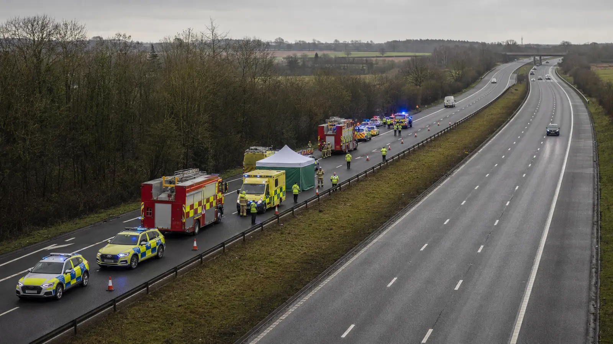

<div align="center">


# MissionChief Map Command Toolkit

<p><strong>One operational layer for the mission, the fleet, the map and the account.</strong></p>

<p><strong>Built for MissionChief UK by <a href="https://github.com/Conroy1988">Conroy1988</a>.</strong><br>Situational awareness, safe native actions and a command surface that adapts to the way you play.</p>

[](https://github.com/Conroy1988/missionchief-toolkit-assets/releases/latest)
[](https://tkb-gaming.scot/mission-chief-scripts/map-command-toolkit/)
[](https://github.com/Conroy1988/missionchief-toolkit-assets/actions/workflows/validate-userscript.yml)
[](#licence-and-independence)

<table>
<tr>
<td width="50%" align="center"><a href="https://tkb-gaming.scot/mission-chief-scripts/map-command-toolkit/"><strong>INSTALL OR UPDATE</strong><br><sub>Supported TKB distribution</sub></a></td>
<td width="50%" align="center"><a href="https://conroy1988.github.io/missionchief-toolkit-assets/"><strong>OPEN THE FIELD GUIDE</strong><br><sub>Setup, features and operation</sub></a></td>
</tr>
<tr>
<td width="50%" align="center"><a href="https://conroy1988.github.io/missionchief-toolkit-assets/themes/"><strong>EXPLORE THE INTERFACES</strong><br><sub>Eight complete command systems</sub></a></td>
<td width="50%" align="center"><a href="status/README.md"><strong>CHECK RELEASE CONTROL</strong><br><sub>Verified production state</sub></a></td>
</tr>
</table>

<sub><a href="#the-command-layer">Overview</a> · <a href="#operational-systems">Systems</a> · <a href="#the-current-command-experience">Experience</a> · <a href="#eight-complete-interface-systems">Interfaces</a> · <a href="#built-for-every-command-post">Devices</a> · <a href="#install-and-enter-command">Install</a> · <a href="#release-integrity">Integrity</a></sub>

</div>

---

## The command layer

MissionChief distributes critical information across the map, mission windows, vehicle tables, alliance pages, transport requests and finance views. The Toolkit brings those signals together without taking authority away from MissionChief.

It helps you **see the operation**, **understand the pressure**, **reach the right native control** and **recover cleanly** when a session becomes crowded.

| INCIDENT | FLEET | MAP | CONTROL |
|:---:|:---:|:---:|:---:|
| Priority, age and requirement intelligence | Status, identity, demand and nearby resources | Coverage, places, profiles and responsive layouts | Finance, diagnostics, backups and safe recovery |

> [!NOTE]
> **Command doctrine:** expose the signal, preserve the source, act through the correct native control, and leave the page recoverable.

---

## From first signal to final account



### See the entire operational picture

The **Incident Command Wire** keeps priority events in sequence. **Mission Age map timers** surface time pressure. **Mission Value** adds verified value context to opened MissionChief windows. **MissionChief UK Knowledge Link** turns live requirements into explainable UK unit, crew, training and personnel evidence.

The map-native **Operational Pressure Board** then reconciles personal and joined alliance missions against the available personal fleet. It accounts for shared demand, specialist shortages, fleet conflicts, reserve risk and patient or prisoner transport pressure before presenting the clearest Top Actions.

### Move through the operation safely

**Toolkit Command Palette** searches live missions, personal vehicles, buildings, Quick Places, bookmarks, profiles, settings and safe commands from one responsive surface. **Contextual Command Menus** bring focused actions to supported missions, vehicles and buildings by right-click or long-press.

Focus, Open and Pin are navigation actions. The board and palette do not select or dispatch vehicles. An **Operational SITREP** is sent only when the user explicitly generates it, through the saved Discord webhook, with mentions suppressed.

---

## Operational systems

### Mission command

| System | What it contributes |
|---|---|
| **Incident Command Wire** | A bounded priority sequence with a wider incident queue and direct map navigation |
| **Operational Pressure Board** | Mission priority, one-vehicle allocation, confirmed shortfalls, fleet conflicts, reserve risk and transport pressure |
| **MissionChief UK Knowledge Link** | Verified UK requirements evidence and direct records from the TKB Guide |
| **Mission Age map timers** | Compact age context above personal missions |
| **Mission Value** | Verified value in opened native mission windows |
| **Unit Commitment** | Response context while MissionChief remains in charge of dispatch |
| **Transport Watcher** | Patient and prisoner transport demand at the point it matters |

### Fleet and transport command

| System | What it contributes |
|---|---|
| **Vehicle Code Status** | A live fleet summary by response code, description and count |
| **Custom Vehicle Badges** | Personal vehicle categories beside native vehicle identity |
| **Unit Locator & Follow Mode** | Local search by caption, ID, type, station or status, followed only after explicit selection |
| **Resource Gap** | Active demand compared with nearby personal availability |
| **Auto-load all vehicles** | MissionChief’s own hidden-vehicle batch control, reached safely |
| **Patient Transport Sweep** | Bounded processing through MissionChief-owned vehicle and release controls with result verification |

### Map and location command

| System | What it contributes |
|---|---|
| **Coverage rings** | Readable response-range context around selected places |
| **Smart Bookmark Labels** | Compact labels, pins and touch previews for saved operational geography |
| **Quick Places** | Fixed jumps to Edinburgh, Fife, Wakefield, London and Newcastle |
| **Profiles and layouts** | Distinct command presentations without changing MissionChief data |
| **Full-Screen Map** | Maximum working area with persistent and <kbd>Esc</kbd> recovery |
| **Tablet Quick Wheel** | Four to eight configurable long-press actions on the map |

### Finance and alliance command

| System | What it contributes |
|---|---|
| **Alliance Credits** | Mission-value and eligibility-aware alliance filtering |
| **Alliance Member Manager** | Member tools confined to a positively identified Members view |
| **Financial intelligence** | Daily, weekly, monthly and custom-period performance context |
| **Reconciliation checkpoints** | Complete periods anchored to MissionChief revenue, spending and sum evidence |
| **Variance preservation** | Unexplained differences remain visible rather than receiving invented classifications |
| **Payout presentations** | Simple, Informative and The Wolf reports, including an optional 1200 × 675 visual report |
| **Discord reporting** | User-triggered finance and SITREP delivery through the configured webhook only |

> [!IMPORTANT]
> **Patient Transport Sweep** uses MissionChief-owned windows and controls, verifies the native result, and stops when authoritative evidence does not change. It is deliberately bounded automation, not a replacement dispatch system.

---

## The current command experience


### Find it. Shape it. Recover it

The current Toolkit experience combines fast discovery with deep personal control:

| DISCOVERY | PERSONALISATION |
|---|---|
| **What’s New & Feature Beacon** introduces new work once and keeps a `NEW` marker on the correct Settings route until viewed. | **Personalisation Studio** brings device layouts, colours, surfaces, Quick Wheel slots, settings backups, first-run guidance and opt-in alerts into one place. |
| **Toolkit Command Palette** opens with <kbd>K</kbd>, the Palette control, Settings or the Tablet Quick Wheel. | **Hotkey & Gesture Studio** remaps Toolkit keyboard commands with duplicate rejection and assigns four optional touch swipes. |
| **Contextual Command Menus** expose safe focus, native-open and local-search actions where the work already is. | **Complete MissionChief Reskinning** can extend the active interface across navigation, lists, windows, tables, forms and buttons while preserving warning meaning. |

| FOCUS | RECOVERY |
|---|---|
| **Smart Auto-Hiding Dock** retracts the command controls while keeping the launcher and version status reachable. | **Toolkit Safe Mode** suspends optional overlays, dashboards, effects and input surfaces while retaining Settings, Doctor, export and recovery. |
| Independent Desktop and Tablet density supports Spacious, Standard, Compact and Command Centre layouts. | **Toolkit Doctor** checks version, interface ownership, persistence, map mounting, public UK intelligence and responsive bounds without copying secrets. |
| Local sounds are synthesised in the browser; notifications require an explicit permission choice. | **One-Click Session Cleanup** previews an allowlist of transient state and protects settings, layouts, themes, profiles, bookmarks, snapshots, webhooks, secrets and Financial Archive history. |

The Layout Builder supports pointer, touch and keyboard movement. Hidden controls remain reachable through Settings and the Palette. The Setup Wizard appears automatically only for a genuinely fresh install and can always be reopened or skipped.

### Command shortcuts

| Key | Action | Key | Action |
|:---:|---|:---:|---|
| <kbd>1</kbd> | My Missions | <kbd>5</kbd> | Alliance Credits |
| <kbd>2</kbd> | Alliance Missions | <kbd>6</kbd> | Mission Age |
| <kbd>3</kbd> | Vehicles | <kbd>V</kbd> | Vehicle Code Status |
| <kbd>4</kbd> | My Buildings | <kbd>B</kbd> | Operational Pressure Board |
| <kbd>K</kbd> | Toolkit Command Palette | <kbd>Esc</kbd> | Recover from Full-Screen Map |

Every Toolkit shortcut can be changed in Hotkey & Gesture Studio.

---

## Eight complete interface systems

Every interface carries the same capability and stored configuration. The visual language changes; the operational contract does not.

| Interface | Command-room character |
|---|---|
| **Map Command** | Clean cyan telemetry and modern dispatch-console clarity |
| **Cyberpunk** | Neon incident signals and angular high-contrast controls |
| **Fallout 4** | Green phosphor terminals and industrial survival controls |
| **Umbrella** | Clinical containment, black surfaces and red-alert discipline |
| **Factorio** | Machinery panels, amber controls and production-line logic |
| **007 Intelligence** | Classified dossiers, restrained black and champagne-gold controls |
| **Hyrule Command** | Royal cartography, luminous energy and ancient command motifs |
| **The Godfather** | Oxblood, antique gold, polished wood and restrained authority |

Inactive interfaces do not keep interface-specific effects or hosted media running. [Explore all eight interface systems](https://conroy1988.github.io/missionchief-toolkit-assets/themes/).

---

## Built for every command post

| Environment | Designed behaviour |
|---|---|
| **Desktop** | Full command panels, internal scrolling, keyboard control and an independently saved density |
| **Ultrawide** | Expanded layouts without unbounded line length or detached controls |
| **Tablet / iPad** | Touch-safe controls, landscape-aware panels, Quick Wheel and a separate density |
| **iPhone Safari** | Safe-area-aware bottom sheets, 44 px targets, toolbar recovery and touch-first navigation |
| **iPad Safari** | Split-view resilience, visual-viewport fitting and orientation recovery |
| **Economy Mode** | Core information retained while non-essential work is suppressed |
| **Reduced motion** | Operational facts preserved with non-essential movement removed |

Responsive behaviour is a feature contract. It is not a desktop layout squeezed into a smaller screen.

---

## Privacy, performance and recovery

### Local by default

- Configuration stays in the browser unless the user explicitly invokes a supported reporting feature.
- UK intelligence loads only after the user opens UK Intel, is schema-validated and contains no player or mission-instance data.
- A safe JSON settings export excludes private integrations, archive identity and history.
- Full settings transfer includes the Discord webhook and Financial Archive only inside passphrase-authenticated AES-256-GCM ciphertext.
- No separate player account, remote telemetry service or external player database is required.

### Quiet when inactive

- Disabled systems must not retain recurring timers or active lifecycle work.
- Inactive interfaces do not load hosted media or keep visual effects alive.
- Broad document scans are avoided where bounded ownership is possible.
- Map, responsive and command state have deterministic teardown and restoration.
- Source contracts guard observer, timer, listener, selector and retired-feature budgets.

### The One We Knew Before

The v7 boundary reset remains an executable product contract: MissionChief is authoritative, retired lifecycle ownership stays retired, independent Toolkit systems remain independently useful, and validation fails if deleted integration work is accidentally restored.

---

## Install and enter command

1. Install **Tampermonkey** or another compatible userscript manager.
2. Open the supported installer: **[Install MissionChief Map Command Toolkit](https://tkb-gaming.scot/mission-chief-scripts/map-command-toolkit/install/)**.
3. Confirm the installation, reload MissionChief and open the Toolkit launcher on the map.
4. Enable only the systems useful to the current account, device and workflow.

> [!IMPORTANT]
> **TKB Scripts is the supported installation and automatic-update authority.** GitHub is the canonical source, validation authority and immutable release archive. [Greasy Fork](https://greasyfork.org/en/scripts/586018-missionchief-map-command-toolkit) is a non-blocking discovery mirror.

| I want to… | Go here |
|---|---|
| Install or update | [TKB product page](https://tkb-gaming.scot/mission-chief-scripts/map-command-toolkit/) |
| Read setup and feature guidance | [MissionChief Map Command Toolkit Guide](https://conroy1988.github.io/missionchief-toolkit-assets/) |
| Explore every visual system | [Interface gallery](https://conroy1988.github.io/missionchief-toolkit-assets/themes/) |
| See the current verified state | [Release Control Panel](status/README.md) |
| Review changes over time | [Changelog](CHANGELOG.md) |
| Read every release | [GitHub Releases](https://github.com/Conroy1988/missionchief-toolkit-assets/releases) |
| Report a confirmed problem | [Issue tracker](https://github.com/Conroy1988/missionchief-toolkit-assets/issues) |
| Discuss an idea | [GitHub Discussions](https://github.com/Conroy1988/missionchief-toolkit-assets/discussions) |

---

## Release integrity

The public page follows live release state rather than embedding a version number that can go stale.

| Authority | Verified destination |
|---|---|
| **Canonical source** | [`src/MissionChief_Map_Command_Toolkit.user.js`](src/MissionChief_Map_Command_Toolkit.user.js) on `main` |
| **Build validation** | [Canonical validation workflow](https://github.com/Conroy1988/missionchief-toolkit-assets/actions/workflows/validate-userscript.yml) |
| **Immutable release** | [Latest GitHub Release](https://github.com/Conroy1988/missionchief-toolkit-assets/releases/latest) |
| **Distribution** | [TKB Scripts](https://tkb-gaming.scot/mission-chief-scripts/map-command-toolkit/) |
| **Checksum** | [`dist/SHA256SUMS.txt`](dist/SHA256SUMS.txt) |
| **Recovery and delivery evidence** | [Release Control Panel](status/README.md) |
| **Hosted asset audit** | [Asset Health](.github/ASSET_HEALTH.md) |

```text
Canonical source  →  exact-head validation  →  immutable GitHub Release
       ↓
TKB install/update verification  →  private recovery backup  →  release confirmation
       ↓
Greasy Fork discovery mirror check (non-blocking)
```

---

<details>
<summary><strong>Full system index</strong></summary>

<br>

**Map:** My Missions · Alliance Missions · Vehicles · My Buildings · Alliance Credits · mission age · coverage rings · Smart Bookmark Labels · Quick Places · bookmarks · profiles · Full-Screen Map · responsive modes

**Missions:** Incident Command Wire · Operational Pressure Board · Operational SITREP · MissionChief UK Knowledge Link · Mission Value · Unit Commitment · Transport Watcher · Patient Transport Sweep

**Fleet:** Vehicle Code Status · Custom Vehicle Badges · Auto-load all vehicles · Resource Gap · Unit Locator & Follow Mode

**Finance:** financial intelligence · reconciliation checkpoints · variance preservation · payout feedback · Simple, Informative and The Wolf Discord reports · Financial Archive

**Command experience:** Toolkit Command Palette · What’s New & Feature Beacon · Contextual Command Menus · Complete MissionChief Reskinning · Smart Auto-Hiding Dock · Hotkey & Gesture Studio · Personalisation Studio

**Safety and recovery:** Toolkit Doctor · Toolkit Safe Mode · One-Click Session Cleanup · protected settings backups · encrypted full transfer · safe export · Update Briefing · Economy Mode · reduced motion

</details>

---

## Licence and independence

The source is released under the MIT Licence.

MissionChief Map Command Toolkit is an independent community userscript created and maintained by [Conroy1988](https://github.com/Conroy1988). It is not operated by, endorsed by or affiliated with SHPlay GmbH or the official MissionChief team.

MissionChief, Leitstellenspiel, Cyberpunk 2077, Fallout, Resident Evil / Umbrella, Factorio, James Bond / 007, The Legend of Zelda and associated names or assets remain the property of their respective owners. Their mention does not imply sponsorship, affiliation or endorsement.

<div align="center">

---

### See the mission · Read the fleet · Command the map · Reconcile the operation

[](https://tkb-gaming.scot/mission-chief-scripts/map-command-toolkit/)

<sub>Canonical source on GitHub · Supported distribution through TKB Scripts · Independent community project</sub>

</div>
