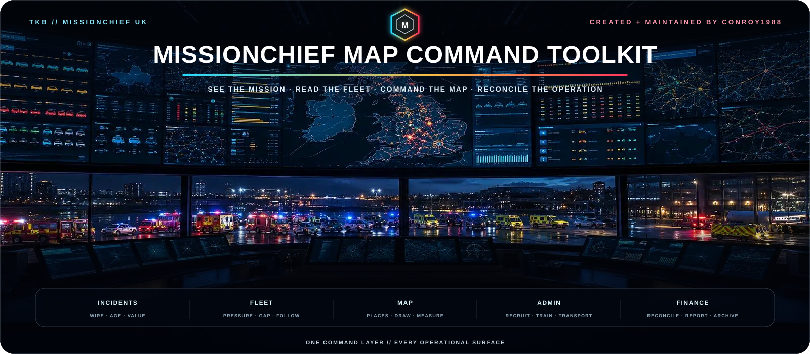
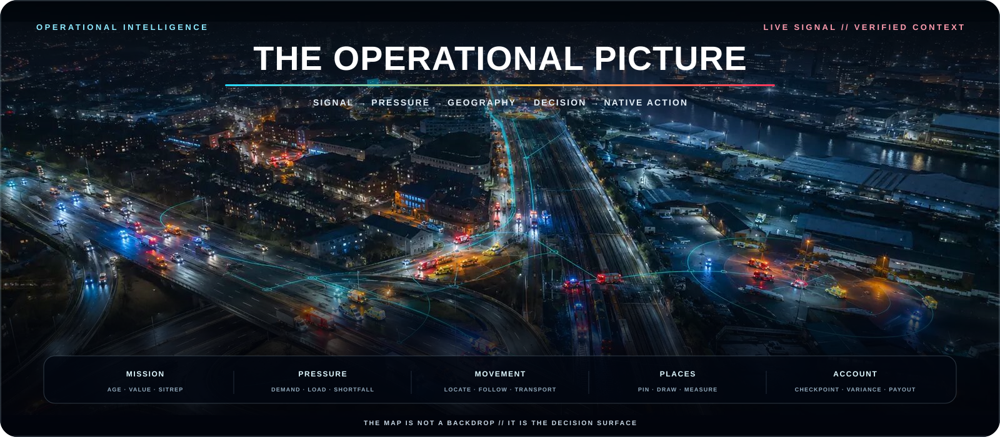
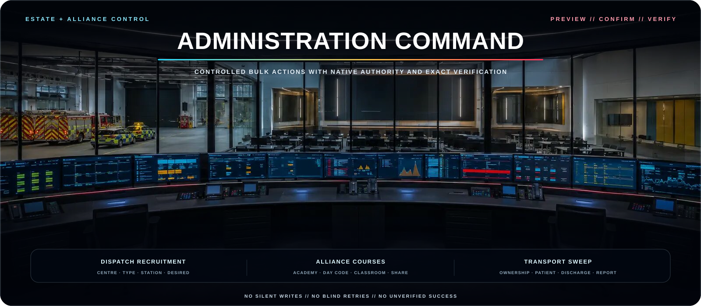
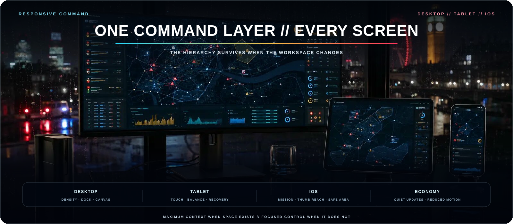
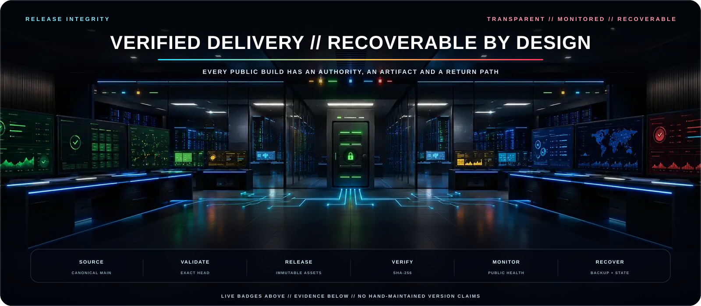

  

<h1 align="center">MissionChief Map Command Toolkit</h1>

  <strong>One operational picture. Every decisive control. No wasted movement.</strong>

  A precision command layer for MissionChief UK — created and maintained by <a href="https://github.com/Conroy1988">Conroy1988</a>.

  
  
  
  

> [!IMPORTANT]
> **TKB Scripts is the only supported installation and update channel.** Use the [Toolkit product page](https://tkb-gaming.scot/mission-chief-scripts/map-command-toolkit/) or [launch the supported installer](https://tkb-gaming.scot/mission-chief-scripts/map-command-toolkit/install/MissionChief_Map_Command_Toolkit.user.js). GitHub remains the canonical source, release archive and public engineering record.

| Enter command | Explore the system |
|---|---|
| **[Install or update the Toolkit](https://tkb-gaming.scot/mission-chief-scripts/map-command-toolkit/install/MissionChief_Map_Command_Toolkit.user.js)** Open the supported TKB Scripts installer. | **[Open the Field Guide](https://conroy1988.github.io/missionchief-toolkit-assets/)** Learn the system from first signal to final account. |
| **[Browse all eight interfaces](https://conroy1988.github.io/missionchief-toolkit-assets/themes/)** Preview every complete command environment. | **[Inspect Release Control](https://github.com/Conroy1988/missionchief-toolkit-assets/blob/release-state/status/README.md)** See publication, verification and recovery state. |

  <a href="#the-command-system">Command system</a> ·
  <a href="#the-operation-end-to-end">Operational flow</a> ·
  <a href="#administration-command">Administration</a> ·
  <a href="#one-command-layer-every-screen">Every screen</a> ·
  <a href="#release-integrity">Release integrity</a> ·
  <a href="#complete-system-index">System index</a> ·
  <a href="#missionchief-ecosystem">Ecosystem</a>

---

## The command system

MissionChief supplies the operational engine. The Toolkit builds the decision surface above it: a coherent layer for seeing incidents, reading fleet pressure, commanding the map, administering organisations and reconciling the result.

It does not invent game actions or replace permissions. It makes MissionChief's native state and controls easier to find, understand and operate—with explicit confirmation wherever an action deserves it.

| Command doctrine | What it changes |
|---|---|
| **See the whole operation** | Mission, fleet, map, administration and finance share one visual and behavioural language. |
| **Bring pressure forward** | Age, value, readiness, demand and resource gaps appear where they can influence a decision. |
| **Reduce movement, not control** | Contextual actions shorten the route while native permissions, confirmations and outcomes stay visible. |
| **Remain recoverable** | Local-first preferences, backups, Safe Mode, diagnostics and one-click cleanup make ambitious customisation reversible. |

  

## The operation, end to end

| Stage | Toolkit response |
|---|---|
| **01 · Detect** | Incident Command Wire surfaces developing work while Mission Age and Mission Value establish urgency and scale. |
| **02 · Understand** | MissionChief UK Knowledge Link, Unit Commitment and Operational SITREP turn a marker into actionable context. |
| **03 · Match** | Operational Pressure Board and Procurement Brain combine live shortages with recent demand history while Vehicle Code Status, Custom Vehicle Badges and Resource Gap expose readiness and load. |
| **04 · Command** | Native My Missions, Alliance Missions, fleet and My Buildings filter shortcuts, Quick Places, bookmarks, coverage rings and on-demand Drawing convert intent into map action. |
| **05 · Act safely** | Contextual Command Menus reach MissionChief's native controls; high-impact administrative work requires a fresh scan, explicit confirmation and sequential execution. |
| **06 · Verify** | Transport outcomes, recruitment results, course starts and financial checkpoints remain visible instead of disappearing behind a click. |
| **07 · Account** | Operational Timeline, Alliance Credits, variance preservation, payout context, Financial Archive and optional reports close the operational loop. |

### Five theatres. One picture.

| Operational theatre | Intelligence and control |
|---|---|
| **Incident command** | Incident Command Wire · Mission Age · Mission Value · MissionChief UK Knowledge Link · Unit Commitment · Operational SITREP |
| **Fleet and transport** | Operational Pressure Board · Procurement Brain · Operational Timeline · Vehicle Code Status · Custom Vehicle Badges · Resource Gap · Transport Watcher · Unit Locator & Follow Mode |
| **Map and places** | Native personal and alliance mission filters · native vehicles and My Buildings filters · separate alliance buildings · Quick Places · smart bookmarks · coverage rings · kilometre measurement · arrows · shapes · zones · text · markers |
| **Administration** | Dispatch Recruitment · Station Icon Copier · Expansion & Upgrade Planner · Alliance Courses · Patient Transport Sweep · Alliance Member Manager · Alliance Buildings performance guard |
| **Finance and accountability** | Alliance Credits · reconciliation checkpoints · variance · payout feedback · Financial Archive · explicit Discord reporting |

---

  

## Administration command

Administration is treated as an operation—not a collection of shortcuts. The Toolkit discovers the current state, asks for intent, previews the scope, then works through native controls in order.

| System | Operational contract |
|---|---|
| **Dispatch Recruitment** | Choose one or all Dispatch Centres, select ALL or one exact native building type before scanning, exclude native unassigned rows, refine exact stations, set Hiring Phase and Personnel Desired independently, and verify assignment immutability after every change. |
| **Station Icon Copier** | Choose an owned station whose custom icon is already correct, derive its exact native type and small/full class, preview an exact subset across one or all Dispatch Centres, protect existing custom icons by default, and pixel-verify each sequential native upload. |
| **Expansion & Upgrade Planner** | Discover current native level, bay and extension actions priced in Credits, select at most one operation per station, enforce a hard budget, revalidate the exact scope and total, then submit and verify each purchase sequentially without automatic mutation retries. |
| **Alliance Courses** | Match academy and building requirements, select the relevant stations, fill available classrooms and schedule the chosen duration—1 hour, 12 hours, 1 day or 2 days—through native course controls. |
| **Patient Transport Sweep** | Re-scan live patient state, require confirmation, use exact native Cancel Transport actions in the background when safe, fall back visibly when needed, and never retry an ambiguous release. |
| **Alliance Member Manager** | Bring member administration into a more legible, deliberate workspace while preserving the permissions supplied by MissionChief. |
| **Alliance Buildings guard** | Keep large alliance estates responsive by preventing an expensive building view from overwhelming the active command surface. |

> [!NOTE]
> Administrative automation is deliberately bounded: fresh state, explicit scope, confirmation before execution, native MissionChief controls, visible outcomes and no retry storm.

## Intelligence that earns its place

The Toolkit only moves information forward when it changes a decision.

| Read the operation | Control the operation |
|---|---|
| **Mission Age** places elapsed time on the map, not in a hidden list. | **Unit Locator & Follow Mode** finds a selected response and keeps its movement in view. |
| **Mission Value** brings likely scale into the first read. | **Toolkit Command Palette** opens the required system without hunting through panels. |
| **Resource Gap** states what the incident still lacks. | **Contextual Command Menus** place relevant actions beside the object being considered. |
| **Operational Pressure Board** turns fleet load into an immediate command signal. | **Hotkey & Gesture Studio** lets keyboard and touch behaviour match the operator. |
| **Procurement Brain** ranks acquisition, repositioning, recruitment and training reviews from live pressure plus repeated local evidence. | **Operational Timeline** filters, searches, focuses and exports meaningful mission history without replacing MissionChief controls. |
| **Operational SITREP** condenses demand and commitment into a usable briefing. | **Personalisation Studio** controls density, layout and visual preference from one place. |

---

  

## One command layer, every screen

The operational hierarchy survives the change in screen—not just the colour scheme. Density, panel geometry, touch targets and dock behaviour adapt while the same systems remain recognisable.

| Surface | Experience |
|---|---|
| **Desktop** | A movable, resizable Toolkit Workspace with readable adaptive columns, direct keyboard command, temporary maximise/restore and a persistent map-attached toolbar. |
| **Tablet** | Reflowed panels, touch-safe targets and the same command structure without a stripped-down feature set. |
| **iOS Mobile** | Compact, touch-first MissionChief operation with administration, patient transport and recovery behaviour designed for the smaller surface. |

### Eight complete interface systems

These are not accent-colour presets. Each is a complete reskin with its own hierarchy, typography, surfaces and command atmosphere.

| Operational systems | Themed systems |
|---|---|
| **Map Command** — focused operational clarity | **Fallout 4** — industrial terminal language |
| **Cyberpunk** — luminous high-contrast telemetry | **Umbrella** — clinical containment control |
| **Factorio** — engineered production surfaces | **007 Intelligence** — restrained classified briefing |
| **Hyrule Command** — cartographic field command | **The Godfather** — cinematic executive control |

**[Explore the full Interface Gallery →](https://conroy1988.github.io/missionchief-toolkit-assets/themes/)**

## The experience layer

| Navigate and control | Personalise and stay informed |
|---|---|
| Toolkit Command Palette · Contextual Command Menus · smart auto-hiding dock | Complete MissionChief Reskinning · Personalisation Studio · Hotkey & Gesture Studio · What’s New & Feature Beacon · Update Briefing · operational notices |

The complete experience also includes Complete MissionChief Reskinning, Smart Auto-Hiding Dock and the What’s New & Feature Beacon—designed as parts of the command layer rather than unrelated add-ons.

---

## Local-first by design

| Boundary | Toolkit position |
|---|---|
| **Identity** | No identity, alliance identity, visitor ID, full user-agent string, referrer or tracking cookie is collected by the Toolkit. |
| **Preferences** | Interface and operating preferences remain local unless you deliberately export them. |
| **Analytics** | Only coarse aggregate product signals are permitted; Global Privacy Control and Do Not Track are honoured. |
| **Discord** | Operational or financial output is sent only when you explicitly request it and only to a saved Discord webhook. |
| **Reports** | Diagnostic reports are generated for manual review and manual sharing. |

## Performance without surrender

- **Economy Mode** reduces visual and processing cost when the device or operation needs it.
- Reduced-motion support keeps the interface calm without removing hierarchy.
- Large-estate guards prevent expensive alliance views from taking over the session.
- Panels and tools initialise only where their context makes them useful.

## Recovery is part of the product

| Safety system | Role |
|---|---|
| **Diagnose** | Toolkit Doctor explains the active state and prepares a reviewable diagnostic report. |
| **Recover** | Toolkit Safe Mode restores a stable operating surface; One-Click Session Cleanup removes current-session Toolkit state. |
| **Transfer** | Backups, encrypted full transfer and deliberate export/import preserve a portable setup without silently moving it. |

The safest ambitious interface is one that can explain itself, step back cleanly and let the operator recover. Disable the userscript and MissionChief is **The One We Knew Before**: the native game remains the boundary and the fallback.

---

  

## Release integrity

No version number or release date is maintained by hand on this page. The release and publication badges read GitHub's current release metadata; build and public-asset badges read the live workflows. A future publication updates the status surface without another README edit.

| Authority | What it proves |
|---|---|
| **[Canonical source](src/MissionChief_Map_Command_Toolkit.user.js)** | The auditable userscript from which a Toolkit build is validated. |
| **[Latest GitHub release](https://github.com/Conroy1988/missionchief-toolkit-assets/releases/latest)** | The immutable public release record, notes and verified asset. |
| **[Release Control](https://github.com/Conroy1988/missionchief-toolkit-assets/blob/release-state/status/README.md)** | The live operational state across source, public delivery, backup and verification. |
| **[Canonical build workflow](https://github.com/Conroy1988/missionchief-toolkit-assets/actions/workflows/validate-userscript.yml)** | Metadata, source integrity, release contracts and repository validation. |
| **[Public asset health](https://github.com/Conroy1988/missionchief-toolkit-assets/actions/workflows/asset-health-monitor.yml)** | Whether documented public assets and the supported delivery path match the canonical release. |

Every release should be attributable, inspectable and recoverable. If the supported public delivery route diverges from the canonical release, the health signal above is intended to make that visible—not hide it behind stale copy.

## Install and enter command

1. Open the **[official TKB Scripts installer](https://tkb-gaming.scot/mission-chief-scripts/map-command-toolkit/install/MissionChief_Map_Command_Toolkit.user.js)**.
2. Approve the userscript in your supported userscript manager.
3. Return to MissionChief UK and reload the page.
4. Open the Toolkit dock or press <kbd>K</kbd> for the Toolkit Command Palette.
5. Use the **[Field Guide](https://conroy1988.github.io/missionchief-toolkit-assets/)** for setup, systems and recovery.

For product information before installation, use the **[TKB Scripts Toolkit page](https://tkb-gaming.scot/mission-chief-scripts/map-command-toolkit/)**.

---

## Complete system index

<strong>Mission intelligence</strong>

- Incident Command Wire
- Mission Age map timers
- Mission Value
- MissionChief UK Knowledge Link
- Unit Commitment
- Operational SITREP

<strong>Fleet, transport and resource intelligence</strong>

- Operational Pressure Board
- Procurement Brain with 24-hour, 7-day and 30-day evidence windows
- Persistent Operational Timeline with event filters, search, focus, JSON export and explicit clearing
- Vehicle Code Status
- Custom Vehicle Badges
- Resource Gap
- Transport Watcher
- Unit Locator & Follow Mode
- Auto-load all vehicles

<strong>Map command and places</strong>

- Buttons 1, 2 and 4 mirror MissionChief’s native My Missions, Alliance Missions and My Buildings filters without opening the filter menu
- Button 3 reads MissionChief’s persisted **Show vehicles on map** value, discovers and submits the exact native form in the game’s global **Map and vehicles** settings area, verifies the result through the settings API and asks MissionChief’s own map routines to refresh; the Toolkit owns no separate vehicle mask and does not depend on an active Dispatch Centre
- MissionChief’s separate Alliance Buildings toggle remains independent and untouched
- Quick Places and Smart Bookmark Labels
- Coverage rings
- Persistent on-demand Drawing
- Kilometre measurement, arrows, shapes, zones, text and markers

<strong>Administration</strong>

- Dispatch Recruitment with Dispatch Centre scope, an explicit ALL-or-one native Building Type selector and exact station selection
- Hiring Phase and Personnel Desired controls
- Station Icon Copier with an owned source station, exact native type/size matching, protected custom icons, exact targets and post-upload pixel verification
- Expansion & Upgrade Planner with fresh native Credit actions, exact station-bound selection, a hard budget and sequential post-purchase verification
- Alliance Courses with academy matching, classroom use and scheduled durations
- Patient Transport Sweep with background-first native cancellation and visible fail-safe fallback
- Alliance Member Manager
- Alliance Buildings performance guard

<strong>Finance and reporting</strong>

- Alliance Credits
- Financial intelligence
- Reconciliation checkpoints and variance preservation
- Payout presentations and feedback
- Financial Archive
- Explicit reports to a saved Discord webhook

<strong>Command experience and accessibility</strong>

- Desktop, Tablet and iOS Mobile Mode
- Toolkit Command Palette
- Personalisation Studio
- What’s New & Feature Beacon
- Contextual Command Menus
- Complete MissionChief Reskinning
- Smart Auto-Hiding Dock
- Hotkey & Gesture Studio
- Eight complete interface systems
- Economy Mode and reduced-motion support

<strong>Safety, diagnostics and continuity</strong>

- Toolkit Doctor
- Toolkit Safe Mode
- One-Click Session Cleanup
- Update Briefing
- Local backups
- Encrypted full transfer
- Deliberate export and import

### Keyboard command

| Key | Action |
|---|---|
| <kbd>1</kbd> · <kbd>2</kbd> | Toggle My Missions · Toggle Alliance Missions |
| <kbd>3</kbd> · <kbd>4</kbd> | Toggle MissionChief Vehicles · Toggle My Buildings |
| <kbd>5</kbd> · <kbd>6</kbd> | Toggle Alliance Credits · Toggle Mission Age |
| <kbd>V</kbd> · <kbd>B</kbd> | Vehicle Code Status · Operational Pressure Board |
| <kbd>K</kbd> | Toolkit Command Palette |

---

## MissionChief ecosystem

| Resource | Go there |
|---|---|
| **TKB Gaming** — community guides and public products | **[Explore TKB Gaming](https://tkb-gaming.scot/)** |
| **Toolkit Field Guide** — setup, command systems and recovery | **[Open the guide](https://conroy1988.github.io/missionchief-toolkit-assets/)** |
| **Mission Graphics Pack** — MissionChief mission markers with permanent response-level visibility | **[Use the mission icons](https://www.missionchief.co.uk/mission_graphics/539)** |
| **Animated UK Fleet** — the companion MissionChief UK vehicle graphics pack | **[Use the fleet graphics](https://www.missionchief.co.uk/vehicle_graphics/5897)** |
| **Community and support** — questions, discussion and operational help | **[Join Discord](https://discord.gg/3ZdXhYjgDm)** · **[Open Discussions](https://github.com/Conroy1988/missionchief-toolkit-assets/discussions)** |
| **Engineering record** — bugs, proposals and public delivery state | **[Issues](https://github.com/Conroy1988/missionchief-toolkit-assets/issues)** · **[Release Control](https://github.com/Conroy1988/missionchief-toolkit-assets/blob/release-state/status/README.md)** |

## Independence, licence and visual note

MissionChief Map Command Toolkit is an independent community project for MissionChief UK. It is not an official MissionChief, SHPlay or XYRALITY product.

The project is created and maintained by **[Conroy1988](https://github.com/Conroy1988)** and released under the **[MIT License](LICENSE)**. See **[CONTRIBUTING.md](CONTRIBUTING.md)**, **[SECURITY.md](SECURITY.md)** and **[SUPPORT.md](SUPPORT.md)** before contributing or reporting a sensitive issue.

The cinematic artwork on this page is original conceptual presentation created for this repository. It depicts no real control room, live emergency operation, official interface, player data or private system.

---

  <strong>The mission is already moving. Your command picture should be ready.</strong>  
  <a href="https://tkb-gaming.scot/mission-chief-scripts/map-command-toolkit/install/MissionChief_Map_Command_Toolkit.user.js"><strong>INSTALL OR UPDATE THE TOOLKIT →</strong></a>

