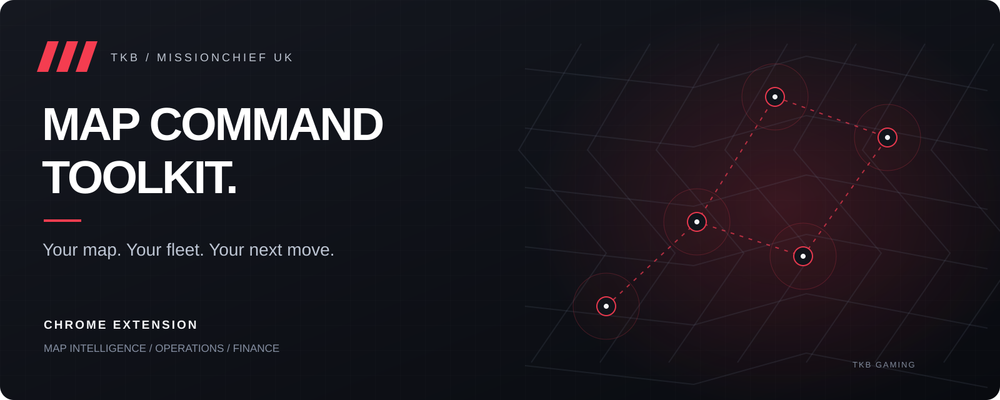
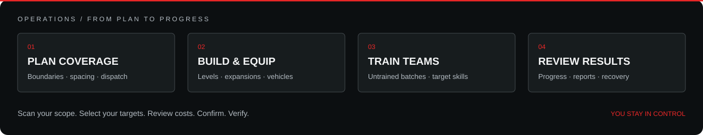

<h1 align="center">MissionChief Map Command Toolkit</h1>

<strong>Your map. Your fleet. Your next move.</strong> A browser extension for MissionChief UK, with practical tools for running a growing operation.

> [!IMPORTANT]
> **The Toolkit is now a Chrome extension. The Tampermonkey/userscript edition is no longer supported.** Install through the **[Chrome Web Store](https://chromewebstore.google.com/detail/lmnojpchebgcochdfnfjmnficicnaaoc)**. Existing script users: **[follow the migration guide](docs/MIGRATING_FROM_USERSCRIPT.md)** before disabling the old copy.

<a href="#built-for-your-operation">Features</a> · <a href="#mission-intelligence">Missions</a> · <a href="#fleet-and-transport">Fleet</a> · <a href="#operations-with-a-plan">Operations</a> · <a href="#finance-and-discord">Finance</a> · <a href="#make-it-your-workspace">Customisation</a> · <a href="#get-started">Get started</a> · <a href="#privacy-and-control">Privacy</a> · <a href="#source-and-releases">Source</a>

## Built for your operation

Bring map controls, mission information, fleet visibility, building workflows and finance into the game. Open **Menu** for the Toolkit and **Game Guide** for the official TKB MissionChief guide.

| When you want to… | Open… |
|---|---|
| **See what your operation is short of** | Operational Pressure Board, Resource Gap and Procurement Brain |
| **Find a mission, vehicle or station quickly** | Command Palette, Unit Locator and saved locations |
| **Build out an area** | Home Response Builder with coverage preview, vehicles and icons |
| **Change your Home Response fleet** | Home Response Unit Switcher, filtered by dispatch centre |
| **Handle repetitive building administration** | Hospital Upgrades, Dispatch Recruitment, Station Icon Copier and Expansion & Upgrade Planner |
| **Understand where your Credits went** | Financial intelligence, historical ledger scans and report comparisons |
| **Make the game fit how you play** | Personalisation Studio, layout controls, themes, hotkeys and Quick Wheel |

**Install the version available in the Store.** The feature descriptions below include the **1.2.5 submission**; Google review and browser update delivery determine when that version becomes available to you. A source commit or test ZIP is not proof of Store approval.

## Mission intelligence

**Know what needs attention, what is already covered and where the next shortage is coming from.**

| Feature | What it brings to your game |
|---|---|
| **Operational Pressure Board** | Compare mission demand with your available fleet, identify competing demands for specialist units, and inspect patient and prisoner transport pressure. Focus, open or pin incidents from the board. Personal missions are included; joined alliance missions are optional. |
| **Procurement Brain** | Review ranked acquisition, repositioning, recruitment and training recommendations based on current shortages and repeated local mission evidence. Recommendations show their supporting evidence; the tool does not purchase or dispatch for you. |
| **Resource Gap** | Inspect mission requirements against your personal fleet within a chosen radius, with an optional map badge. |
| **Mission Age map timers** | See how long personal missions have been waiting directly above their map markers. |
| **Mission Value** | See available mission-value information inside opened mission windows. Unavailable values are left hidden. |
| **Incident Command Wire** | Follow a prioritised incident feed. Incidents leave the attendance queue when one of your units is on scene and can return when the last one leaves. |
| **Operational Timeline** | Enable a searchable local history of mission changes, responses, demand, stalls, recoveries and completions. Filter, export or clear it. Logging starts off. |
| **Alliance Credits** | Inspect alliance mission values with eligibility-aware states and value filters. |

## Fleet and transport

**Find the right unit and see what is keeping vehicles occupied.**

| Feature | What it brings to your game |
|---|---|
| **Vehicle Code Status** | View status-code descriptions and live fleet totals, including out-of-service vehicles. |
| **Unit Locator & Follow Mode** | Search your vehicles by name, ID, type, station or status. Locate one on the map or deliberately follow its live marker, with a visible Stop control. |
| **Transport Watcher** | Highlight missions still waiting for patient or prisoner transport, with map indicators and counts. |
| **Patient Transport Sweep** | Scan eligible alliance patient transports, review the scope and use the game's native patient-release controls. Follow progress and retain the completion report for review. |
| **Auto-load all vehicles** | Use the game's native vehicle-list batch control inside the active mission window to reveal additional vehicles. |

## Map tools and navigation

**Keep useful information on the map and reach the rest quickly.**

| Feature | What it brings to your game |
|---|---|
| **UK Building Filters** | Access native building-type filters, with commonly used types placed first. |
| **Command Palette** | Search Toolkit commands, settings, live missions, personal vehicles, buildings and saved locations from one place. |
| **Drawing & Map Measure** | Measure distances in kilometres and add temporary lines, arrows, freehand sketches, shapes, zones, text and markers. |
| **Coverage rings & map overlays** | Add geographic context and control what is visible around your operating area. |
| **Saved locations & Smart Bookmark Labels** | Jump back to useful places with compact labels that retain access to their full names. |
| **Contextual Command Menus** | Open item-specific actions with a desktop right-click or supported touch long-press. |
| **Game Guide** | Open the official TKB MissionChief guide in a new tab directly beside **Menu**, keeping the game open. |

## Operations with a plan

### Home Response Builder

Choose a city from search or the city list, select a boundary directly on the map, draw an area, or use a centre and radius.

- Set **1, 3, 4, 6, 8 or 10-mile spacing**, with up to **1,000 new locations**.
- Preview coverage around existing Home Responses, with mapped sea and major-lake exclusions.
- See named dispatch centres on the map. The nearest is selected automatically; acknowledge its distances before building.
- Select an allowed vehicle and an icon from the saved catalogue. Scan a particular building type when refreshing icons.
- Review estimated Credit costs, then follow saved progress through construction, vehicle purchase and optional icon copying.

Spacing is straight-line distance. Small waterways, road access and staffing/training still need your review. A limit of 20 means at most 20 proposals, spread across the chosen area.

### Home Response Unit Switcher

Select **All dispatch centres**, a named centre or Unassigned. Choose the current vehicle type and an allowed replacement, then select the vehicles to change.

- Shared fleet checks and concurrent shop reads make previews faster.
- Native **Credit** offers are checked across shop categories.
- Full single-vehicle buildings may show a clearly labelled estimate before removal; an enabled purchase offer is required afterwards.
- **Review & resume** checks saved progress before continuing an interrupted replacement.

> [!WARNING]
> Replacement permanently removes the selected old vehicle. If the next purchase fails, that building can temporarily have an empty slot. New vehicles use game-default names; staff and training are not automatically supplied. Review the selected vehicles and costs before confirming.

### Hospital Upgrades

Select hospitals and a **target level from 1 to 30**. The tool uses the game's direct target-level purchase rather than buying each intermediate level separately. Review your current balance, estimated costs and results; maximum-level completion is checked against the hospital record.

### Recruitment, courses and building management

| Feature | What it brings to your game |
|---|---|
| **Dispatch Recruitment** | Choose one or all dispatch centres, filter station types, then set the hiring phase and desired personnel for a reviewed selection of buildings. |
| **Station Icon Copier** | Choose an owned station's custom icon and apply it to a reviewed subset of matching station types. Existing custom icons are protected by default. |
| **Expansion & Upgrade Planner** | Inspect native Credit offers for building levels, bays and extensions, then prepare purchases within the selected scope and budget. |
| **Alliance Courses** | Scan eligible academy courses and start ready courses through the game's native education controls, with sequential progress and results. |
| **Alliance Member Manager** | Filter and sort members by role and activity, and explicitly load additional pages when needed. |
| **Guided Operations** | Work through scope, configuration, review, execution and results. **Back to Operations** returns to tool selection without clearing selections or stopping an active task. |

[Detailed setup and operating guidance →](docs/EXTENSION_GUIDE.md)

## Finance and Discord

**Read the numbers, investigate changes and share a report when you choose.**

| Feature | What it brings to your game |
|---|---|
| **Financial intelligence** | Review income, spending, net position, reconciliation and variance using your in-game financial data. |
| **Historical ledger archive** | Scan available ledger history on demand, retain it locally and continue supported interrupted scans. The available game history determines what can be reported. |
| **Period comparisons** | Compare the selected reporting period with the preceding period where data and report settings allow. |
| **Report styles** | Choose **Simple**, **Informative** or **The Wolf** financial reporting, depending on how much detail you want. |
| **Optional Discord reports** | Prepare financial reports, transport-sweep reports or operational SITREPs. Review and confirm before sending to your configured webhook. |
| **Payout presentations** | Add themed mission-completion banners, with optional sound and emergency-flash effects. |

## Make it your workspace

**A configurable command area, from the controls you pin to the way the game looks.**

| Feature | What it brings to your game |
|---|---|
| **Personalisation Studio** | Manage appearance, layouts, controls, alerts and recovery from one place, with separate desktop, tablet and mobile preferences. |
| **Themes & MissionChief reskinning** | Choose from eight interface themes, apply supported custom theme codes and extend styling across game windows, lists, forms and tables. Restore the native appearance when you prefer. |
| **Resizable desktop workspace** | Move, resize or temporarily maximise the Toolkit panel, with saved geometry and keyboard resize controls. |
| **Pinned commands & auto-hiding dock** | Keep chosen tools readily available and tuck the dock away when map space matters more. |
| **Quick Wheel** | Configure touch-friendly shortcuts for frequently used commands and locations. |
| **Hotkey & Gesture Studio** | Remap keyboard commands and opt-in touch gestures, with duplicate-key checks and default restoration. |
| **Economy Mode** | Reduce non-essential animation and effects while retaining operational features. |
| **What's New & Feature Beacon** | Reopen release guidance and find newly introduced controls. |

## Recovery and everyday control

| Feature | What it brings to your game |
|---|---|
| **Operations Status Centre** | Inspect module health, freshness, workflow progress and Safe Mode status. |
| **Toolkit Doctor** | Run user-triggered diagnostics and supported UI repair, with a privacy-conscious report for troubleshooting. |
| **Toolkit Safe Mode** | Suspend optional modules while retaining access to settings and recovery, then restore your choices when leaving Safe Mode. |
| **Settings import/export & snapshots** | Back up supported configuration and use local recovery snapshots. This is not automatic cross-device syncing. |
| **One-Click Session Cleanup** | Preview and clear supported temporary Toolkit state while protecting durable settings, bookmarks, secrets and finance history. |
| **Extension version & updates** | Check the installed extension version; public installation and browser-managed updates come through the Chrome Web Store. |

**Explore further:** [Setup and operating guide](docs/EXTENSION_GUIDE.md) · [Feature reference](https://conroy1988.github.io/missionchief-toolkit-assets/features/) · [Extension release notes](extension/CHANGELOG.md)

## Get started

1. **[Install from the Chrome Web Store](https://chromewebstore.google.com/detail/lmnojpchebgcochdfnfjmnficicnaaoc)** in a compatible browser.
2. Disable any older **Toolkit** userscript or duplicate Toolkit extension. You can keep Tampermonkey for other scripts.
3. Open the extension popup, enable the Toolkit and apply/reload.
4. Fully reload **[MissionChief UK](https://www.missionchief.co.uk/)**, then open **Menu**.

**Already using Tampermonkey?** Export any settings you need before disabling the old copy. Ordinary settings may migrate, but complete transfers between userscript, unpacked and Store installations are not guaranteed. **[Migration steps →](docs/MIGRATING_FROM_USERSCRIPT.md)**

**Mobile:** Orion on iOS has been used for testing ZIP builds. Browser extension support varies; ordinary iPhone Safari cannot install this Chrome extension. Test packages are for explicit testing, not the public release channel.

## Privacy and control

- The Toolkit starts disabled until you enable it.
- Settings, supported caches and saved task progress stay in browser storage; they are not synced across devices by the Toolkit.
- Confirmed operations act on your signed-in MissionChief account and can spend Credits. Saved queues do not authorise automatic replay.
- Discord reporting is optional and requires confirmation. Webhook credentials stay in extension storage.
- City lookup and map tiles use OpenStreetMap services. Executable extension code is packaged locally.

Read the **[privacy policy](extension/store/PRIVACY.md)** for storage, requests, retention and provider details. Never put account credentials or webhook URLs in a public issue.

## Source and releases

| Looking for | Location |
|---|---|
| **Public installation and updates** | [Chrome Web Store](https://chromewebstore.google.com/detail/lmnojpchebgcochdfnfjmnficicnaaoc) |
| **Extension source and build instructions** | [extension/](extension/README.md) |
| **Release notes** | [Extension changelog](extension/CHANGELOG.md) |
| **Bugs and performance reports** | [GitHub Issues](https://github.com/Conroy1988/missionchief-toolkit-assets/issues/new/choose) · [Support](SUPPORT.md) |
| **Legacy migration delivery** | [Migration package and deployment notes](legacy/README.md) |
| **Historical userscript source** | [src/](src/) — retained for provenance and recovery; unsupported |

The extension build currently composes the recovered release baseline with maintained feature modules. **[Development instructions](CONTRIBUTING.md)** explain how to reproduce the package and run its checks. Historical GitHub userscript releases and release-state dashboards are archives; their version numbers do not describe the Chrome Store extension.

## Community

**[TKB MissionChief Game Guide](https://tkb-gaming.scot/games/missionchief/guides/)** · **[TKB Gaming](https://tkb-gaming.scot/)** · **[Discord](https://discord.gg/3ZdXhYjgDm)**

**Developer: [Conroy1988](https://github.com/Conroy1988).**

Independent community software; not an official MissionChief, SHPlay or XYRALITY product. Existing source licence notices remain applicable. The artwork above is original schematic branding, not a screenshot or a real emergency operation.

<a href="https://chromewebstore.google.com/detail/lmnojpchebgcochdfnfjmnficicnaaoc"><strong>GET THE TOOLKIT ON THE CHROME WEB STORE →</strong></a>

