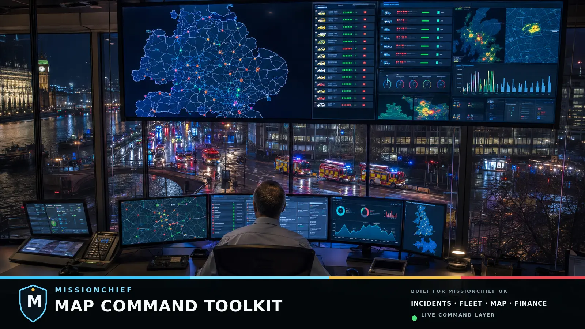
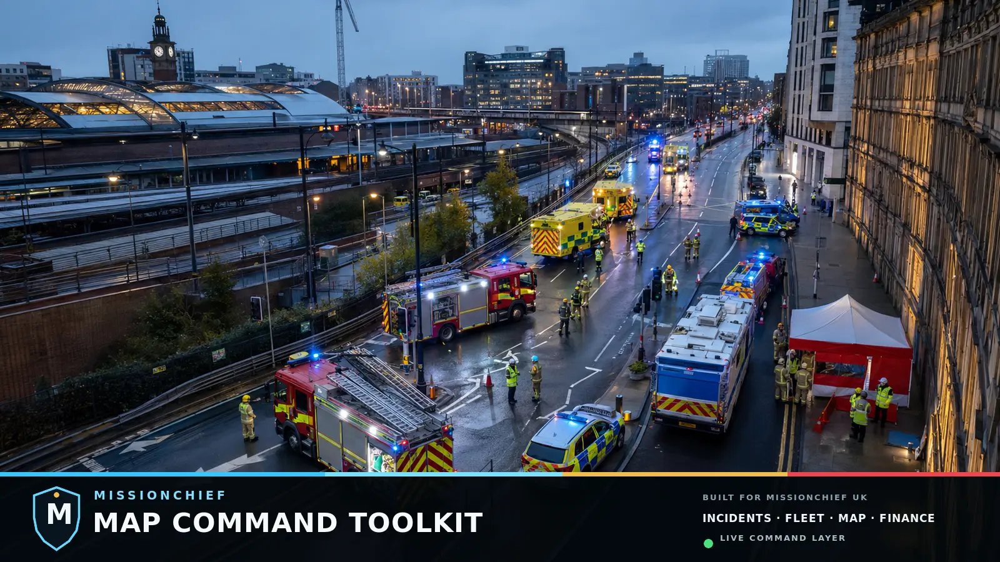
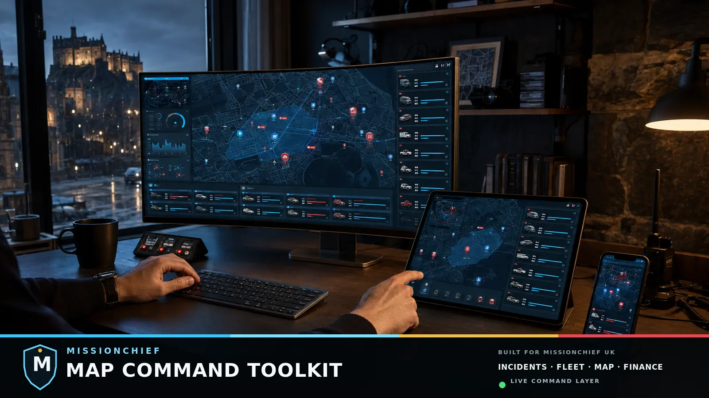
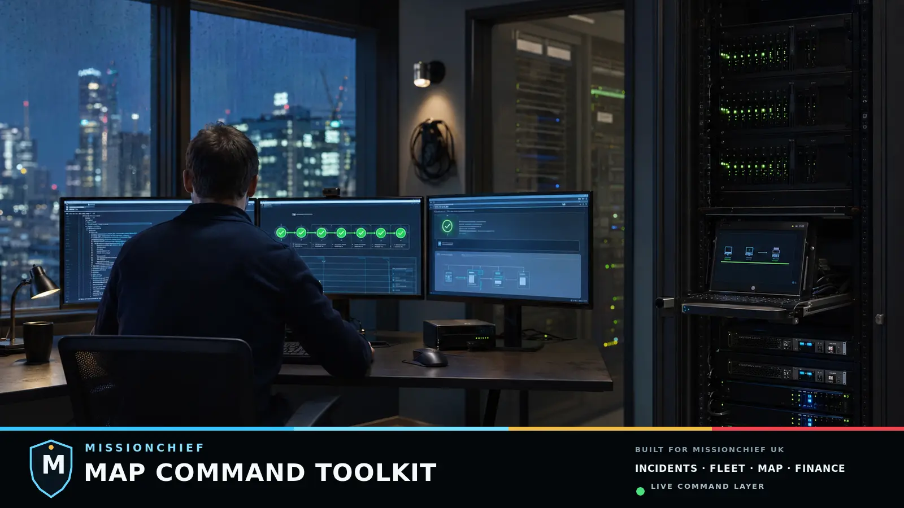

<p align="center">
  
</p>

<h1 align="center">MissionChief Map Command Toolkit</h1>

<p align="center">
  <strong>See the mission. Read the fleet. Command the map. Reconcile the operation.</strong>
</p>

<p align="center">
  A precision command layer for MissionChief UK — created and maintained by <a href="https://github.com/Conroy1988">Conroy1988</a>.
</p>

<p align="center">
  <a href="https://github.com/Conroy1988/missionchief-toolkit-assets/releases/latest"></a>
  <a href="https://github.com/Conroy1988/missionchief-toolkit-assets/releases/latest"></a>
  <a href="https://github.com/Conroy1988/missionchief-toolkit-assets/actions/workflows/validate-userscript.yml"></a>
</p>

<p align="center">
  <a href="https://tkb-gaming.scot/mission-chief-scripts/map-command-toolkit/"></a>
</p>

> [!IMPORTANT]
> **TKB Scripts is the only supported install and update channel.** GitHub is the canonical source, release archive and public engineering record — not the end-user installer.

| Enter command | Explore the system |
|---|---|
| **[Install or update from TKB Scripts](https://tkb-gaming.scot/mission-chief-scripts/map-command-toolkit/)**<br>Enter through the supported product channel. | **[Open the Field Guide](https://conroy1988.github.io/missionchief-toolkit-assets/)**<br>Learn the command layer from first signal to final account. |
| **[Browse the Interface Gallery](https://conroy1988.github.io/missionchief-toolkit-assets/themes/)**<br>See all eight complete interface systems. | **[Inspect Release Control](https://github.com/Conroy1988/missionchief-toolkit-assets/blob/release-state/status/README.md)**<br>Read the live delivery, backup and verification state. |

<p align="center">
  <a href="#the-command-layer">Command layer</a> ·
  <a href="#from-first-signal-to-final-account">Operational flow</a> ·
  <a href="#one-command-layer-every-screen">Every screen</a> ·
  <a href="#eight-complete-interface-systems">Interface systems</a> ·
  <a href="#release-without-guesswork">Release integrity</a> ·
  <a href="#install-and-enter-command">Install</a>
</p>

---

## The command layer

MissionChief is the operational engine. The Toolkit is the decision surface above it: a dark, high-contrast command environment that turns missions, units, transport, places and finance into one legible picture.

It never invents game actions. Every action remains traceable to MissionChief's native controls; the Toolkit improves how quickly you can see, understand and reach them.

| Command principle | What it means in practice |
|---|---|
| **Signal over noise** | Operationally useful information moves forward. Decoration steps back. |
| **Context before clicks** | The right status, gap or action appears where the decision is being made. |
| **One coherent picture** | Mission, fleet, map and finance share the same visual and behavioural language. |
| **Safe by construction** | Native actions, local preferences, clear recovery paths and explicit boundaries. |

<p align="center">
  
</p>

## From first signal to final account

| Operational stage | Command capability |
|---|---|
| **01 · See the incident** | Incident Command Wire surfaces developing activity; map timers reveal Mission Age; Mission Value gives immediate scale; MissionChief UK Knowledge Link brings the relevant operational context into reach. |
| **02 · Read the fleet** | Operational Pressure Board, Vehicle Code Status, Custom Vehicle Badges and Resource Gap expose readiness, load and shortfall; Unit Locator & Follow Mode keeps a selected response in view. |
| **03 · Command the map** | The persistent Drawing toolbar button, Toolkit Command Palette, Contextual Command Menus, Quick Places, bookmarks and coverage rings turn navigation into direct intent: open, focus, pin, follow, draw, measure or return. |
| **04 · Reconcile the operation** | Alliance Credits and financial intelligence preserve checkpoints, variance and payout context; explicit reports can be sent only to a saved Discord webhook. |

### Four channels, one operational picture

| Channel | What moves forward |
|---|---|
| **Mission command** | Incident Command Wire · Mission Age · Mission Value · Unit Commitment · Patient Transport Sweep · Operational SITREP |
| **Fleet and transport** | Operational Pressure Board · Vehicle Code Status · Resource Gap · Transport Watcher · Unit Locator & Follow Mode |
| **Map and places** | My Missions · Alliance Missions · Vehicles · Buildings · Quick Places · bookmarks · coverage rings · on-demand Drawing with kilometre measurement, arrows, shapes, zones, text and markers |
| **Finance and alliance** | Alliance Credits · reconciliation checkpoints · variance preservation · payout feedback · Financial Archive |

---

<p align="center">
  
</p>

## One command layer, every screen

The operational hierarchy stays intact as the workspace changes. Controls reflow, density adjusts and touch targets expand without turning the product into a different tool.

| Environment | Designed behaviour |
|---|---|
| **Desktop and ultrawide** | Maximum situational density, a stable dock, fast switching and a wide operational canvas. |
| **Tablet and iPad** | Touch-first command surfaces, balanced panels and strong landscape or portrait recovery. |
| **iPhone and iOS Mobile** | Focused mission context, thumb-reachable actions and a visual-viewport-safe Drawing bottom sheet that keeps the live map available. |
| **Economy Mode and reduced motion** | Lower visual workload and quieter updates while preserving core command information. |

## The command experience

| Move | System |
|---|---|
| **Discover** | Toolkit Command Palette, Hotkey & Gesture Studio and Contextual Command Menus make every major surface reachable without hunting. |
| **Personalise** | Personalisation Studio, Complete MissionChief Reskinning and Smart Auto-Hiding Dock shape one deliberate workspace rather than a pile of add-ons. |
| **Stay oriented** | What’s New & Feature Beacon explains change in context; Unit Locator & Follow Mode and mission signals preserve operational continuity. |
| **Recover cleanly** | Toolkit Doctor, Toolkit Safe Mode and One-Click Session Cleanup provide visible, bounded recovery without damaging the native game. |

### Command shortcuts

| Key | Opens | Key | Opens |
|---:|---|---:|---|
| `1` | My Missions | `2` | Alliance Missions |
| `3` | Vehicles | `4` | My Buildings |
| `5` | Alliance Credits | `6` | Mission Age |
| `V` | Vehicle Code Status | `B` | Operational Pressure Board |
| `K` | Toolkit Command Palette | — | — |

---

## Eight complete interface systems

These are not colour swaps. Each system retunes surfaces, borders, signals, typography and atmosphere while keeping the same command grammar. **[Explore the live interface gallery →](https://conroy1988.github.io/missionchief-toolkit-assets/themes/)**

| Interface system | Direction |
|---|---|
| **Map Command** | The signature cyan, gold and emergency-red operations room. |
| **Cyberpunk** | Electric neon, deep contrast and a high-energy tactical grid. |
| **Fallout 4** | Worn terminal green and retro-future field instrumentation. |
| **Umbrella** | Clinical containment, hard geometry and controlled warning red. |
| **Factorio** | Industrial panels, engineered density and production-floor clarity. |
| **007 Intelligence** | Restrained intelligence-suite polish with precise gold accents. |
| **Hyrule Command** | Ancient-symbol warmth translated into a modern command surface. |
| **The Godfather** | Black, ivory and quiet authority for a cinematic executive room. |

---

## Privacy, performance and recovery

| Guarantee | Operational boundary |
|---|---|
| **Local-first preferences** | Interface settings stay in the browser unless you explicitly export or transfer them. |
| **Anonymous outcomes only** | Coarse first-party analytics can measure feature outcomes, respect Global Privacy Control and Do Not Track, and never send player identity, alliance identity, a visitor ID, full user agent, referrer or an analytics cookie. |
| **Quiet when inactive** | The Toolkit avoids pointless background work and offers Economy Mode plus reduced motion for constrained devices. |
| **A clean return path** | Disable the userscript and MissionChief is **The One We Knew Before**. The native game remains the boundary and the fallback. |

Protected settings backups, encrypted full transfer and safe export support deliberate recovery. No configuration transfer is silent; no Discord report is automatic.

---

<p align="center">
  
</p>

## Release without guesswork

The badges at the top of this page are live views of GitHub release and workflow metadata. **No version number or publication date is hard-coded into this README.** Publish a new repository release and the visible release identity updates automatically; the validation badge follows the canonical workflow on `main`.

| Authority | Verified destination |
|---|---|
| **Canonical source** | [`src/MissionChief_Map_Command_Toolkit.user.js`](src/MissionChief_Map_Command_Toolkit.user.js) on `main` |
| **Exact-head validation** | [Canonical validation workflow](https://github.com/Conroy1988/missionchief-toolkit-assets/actions/workflows/validate-userscript.yml) |
| **Immutable release archive** | [Latest GitHub Release](https://github.com/Conroy1988/missionchief-toolkit-assets/releases/latest) |
| **Supported distribution** | [TKB Scripts product channel](https://tkb-gaming.scot/mission-chief-scripts/map-command-toolkit/) |
| **Published checksum** | [`dist/SHA256SUMS.txt`](dist/SHA256SUMS.txt) |
| **Delivery and recovery evidence** | [Live Release Control Panel](https://github.com/Conroy1988/missionchief-toolkit-assets/blob/release-state/status/README.md) |

```text
Canonical source → exact-head validation → immutable GitHub release
        ↓
TKB verification → private recovery backup → Discord confirmation
```

The installed Toolkit also checks the authoritative `release-state` manifest on its normal schedule. When a newer published release exists, the status changes from **LATEST** to **UPDATE** and opens the supported TKB product page.

---

## Install and enter command

1. Install a compatible userscript manager for your browser.
2. Open the **[MissionChief Map Command Toolkit page on TKB Scripts](https://tkb-gaming.scot/mission-chief-scripts/map-command-toolkit/)**.
3. Choose **[Install Toolkit](https://tkb-gaming.scot/mission-chief-scripts/map-command-toolkit/install/)** and approve the userscript manager prompt.
4. Load MissionChief UK. The command layer starts with safe defaults and introduces its controls in context.

> [!NOTE]
> Global launchers, dock controls and map overlays are limited to the top-level MissionChief map. Supported page enhancements can still operate independently on their relevant pages.

For normal updates, revisit the TKB product page or follow the in-Toolkit **UPDATE** signal. Do not replace an installed build from an unverified source.

---

<details>
<summary><strong>Full system index</strong></summary>

<br>

**Map:** My Missions · Alliance Missions · Vehicles · My Buildings · Alliance Credits · Mission Age · coverage rings · on-demand Drawing and kilometre measurement · Smart Bookmark Labels · Quick Places · bookmarks · profiles · Full-Screen Map · responsive modes

**Missions:** Incident Command Wire · Operational Pressure Board · Operational SITREP · MissionChief UK Knowledge Link · Mission Value · Unit Commitment · Transport Watcher · Patient Transport Sweep

**Fleet:** Vehicle Code Status · Custom Vehicle Badges · Auto-load all vehicles · Resource Gap · Unit Locator & Follow Mode

**Finance:** financial intelligence · reconciliation checkpoints · variance preservation · payout feedback · Simple, Informative and The Wolf Discord reports · Financial Archive

**Command experience:** Toolkit Command Palette · What’s New & Feature Beacon · Contextual Command Menus · Complete MissionChief Reskinning · Smart Auto-Hiding Dock · Hotkey & Gesture Studio · Personalisation Studio

**Safety and recovery:** Toolkit Doctor · Toolkit Safe Mode · One-Click Session Cleanup · protected settings backups · encrypted full transfer · safe export · Update Briefing · Economy Mode · reduced motion

</details>

## Support and contribute

| Need | Destination |
|---|---|
| Read the operational guide | [Toolkit Field Guide](https://conroy1988.github.io/missionchief-toolkit-assets/) |
| Review release history | [GitHub Releases](https://github.com/Conroy1988/missionchief-toolkit-assets/releases) and [`CHANGELOG.md`](CHANGELOG.md) |
| Report a confirmed problem | [Issue tracker](https://github.com/Conroy1988/missionchief-toolkit-assets/issues) |
| Propose an idea or discuss operations | [GitHub Discussions](https://github.com/Conroy1988/missionchief-toolkit-assets/discussions) |
| Contribute safely | [`CONTRIBUTING.md`](CONTRIBUTING.md), [`CODE_OF_CONDUCT.md`](CODE_OF_CONDUCT.md) and [`SECURITY.md`](SECURITY.md) |

## Licence and independence

The source is released under the MIT Licence.

MissionChief Map Command Toolkit is an independent community userscript created and maintained by [Conroy1988](https://github.com/Conroy1988). It is not operated by, endorsed by or affiliated with SHPlay GmbH or the official MissionChief team.

MissionChief, Leitstellenspiel, Cyberpunk 2077, Fallout, Resident Evil / Umbrella, Factorio, James Bond / 007, The Legend of Zelda and associated names or assets remain the property of their respective owners. Their mention does not imply sponsorship, affiliation or endorsement.

<div align="center">

---

### The operation is already moving. See all of it.

[](https://tkb-gaming.scot/mission-chief-scripts/map-command-toolkit/)

<sub>Canonical source on GitHub · Supported distribution through TKB Scripts · Independent community project</sub>

</div>
