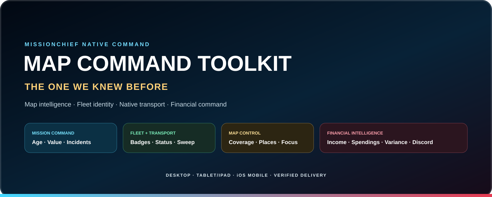
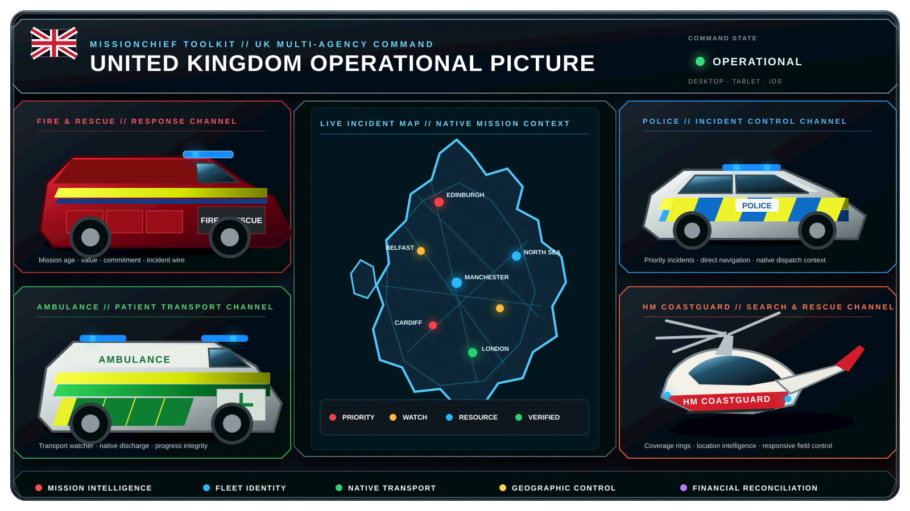

<div align="center">



# MissionChief Map Command Toolkit

### **A retro emergency control layer for the MissionChief map**

**Incident command · Mission intelligence · Fleet identity · Native transport · Geographic control · Financial reconciliation**

[](https://update.greasyfork.org/scripts/586018/MissionChief%20Map%20Command%20Toolkit.user.js)
[](https://conroy1988.github.io/missionchief-toolkit-assets/)
[](https://conroy1988.github.io/missionchief-toolkit-assets/themes/)
[](status/README.md)

## **Current verified release: `v7.1.3`**
### **Continuous Incident Command news reel**

[](https://github.com/Conroy1988/missionchief-toolkit-assets/releases/latest)
[](https://greasyfork.org/en/scripts/586018-missionchief-map-command-toolkit)
[](https://greasyfork.org/en/scripts/586018-missionchief-map-command-toolkit)
[](https://github.com/Conroy1988/missionchief-toolkit-assets/stargazers)
[](https://github.com/Conroy1988/missionchief-toolkit-assets)
[](https://github.com/Conroy1988/missionchief-toolkit-assets/actions/workflows/validate-userscript.yml)
[](#licence-and-attribution)

[**Control-room briefing**](#control-room-briefing) · [**Incident Command**](#incident-command-wire) · [**Command divisions**](#four-command-divisions) · [**Interfaces**](#seven-complete-interface-systems) · [**Field devices**](#built-for-every-screen) · [**Install**](#install-in-under-a-minute) · [**Release control**](#verified-delivery-and-recovery)

</div>

---

# Control-room briefing

MissionChief exposes operational information across the map, opened incidents, vehicle tables, transport controls, alliance pages, finance views and separate navigation surfaces.

**MissionChief Map Command Toolkit turns those native signals into one configurable command layer.** It helps the player identify urgent work, recognise fleet capability, understand geographic context, manage selected transport workflows, monitor high-value incidents and reconcile operational performance—without replacing MissionChief's own mission windows or dispatch controls.

<table>
<tr>
<td width="25%" align="center"><strong>🚨 INCIDENT</strong><br><sub>Broadcast priority work through one bounded command wire.</sub></td>
<td width="25%" align="center"><strong>🚒 FLEET</strong><br><sub>Read response codes, custom identity and nearby capability.</sub></td>
<td width="25%" align="center"><strong>🗺️ MAP</strong><br><sub>Turn range, location and saved places into command context.</sub></td>
<td width="25%" align="center"><strong>📟 CONTROL</strong><br><sub>Keep every feature bounded, restorable and device-aware.</sub></td>
</tr>
</table>

> **Control-room doctrine:** see the signal, understand the source, act through the correct native control, and leave the page recoverable.

<div align="center">



</div>

---

# Live dispatch status

| Control channel | State | Evidence |
|---|:---:|---|
| **Canonical source** | 🟢 | Validated `src/MissionChief_Map_Command_Toolkit.user.js` |
| **Production release** | 🟢 | GitHub Release `v7.1.3` published |
| **Public distribution** | 🟢 | Greasy Fork version and metadata verified |
| **Private recovery** | 🟢 | Versioned backup commit retained |
| **Discord release signal** | 🟢 | Verified release announcement posted |
| **Hosted media** | 🟢 | 37 discovered · 33 referenced · 0 missing |
| **Responsive command** | 🟢 | Desktop · Tablet/iPad · iPhone/iPad Safari |

The release control panel is machine-backed rather than manually asserted: [open the current verified release state](status/README.md).

---

# Incident Command Wire

The Toolkit's live incident surface is designed like a restrained emergency broadcast strip rather than a second mission list.

## Current v7.1.3 behaviour

- moves priority incidents continuously from right to left at a constant broadcast speed;
- renders an accessibility-safe duplicate sequence so the reel loops off-screen without an empty gap or visible jump;
- keeps the fixed **Incident Command** identity separate from the moving incident data;
- preserves one expanded queue control for deliberate incident selection;
- supports direct click-to-zoom navigation;
- centres the complete incident row across all seven interfaces and supported layouts;
- pauses or suppresses non-essential motion under reduced-motion, hidden-tab and Economy Mode conditions; and
- retains permanent source and executable contracts for loop ownership, dynamic speed, seeking and accessibility.

The result is persistent situational awareness without card clutter, duplicated missions or an uncontrolled animation lifecycle.

---

# Four command divisions

## 1. Mission command

| Capability | Operational purpose |
|---|---|
| **Incident Command Wire** | Broadcasts the highest-priority incident sequence with an expanded queue and direct navigation |
| **Mission Age map timers** | Adds compact age badges above personal missions; shortcut `6` toggles the surface |
| **Mission Value** | Shows verified mission value inside opened MissionChief windows |
| **Unit Commitment** | Presents committed response context without replacing native dispatch controls |
| **Transport Watcher** | Identifies patient and prisoner transport demand |

## 2. Fleet and transport command

| Capability | Operational purpose |
|---|---|
| **Vehicle Code Status** | Summarises the live fleet by response code, description and count |
| **Custom Vehicle Badges** | Shows Own Vehicle Categories beside native vehicle types without replacing native identity |
| **Auto-load all vehicles** | Uses MissionChief's native hidden-vehicle batch control |
| **Patient Transport Sweep** | Processes eligible alliance ambulances through MissionChief's native vehicle window and discharge control |
| **Resource Gap** | Compares active demand with nearby personal vehicle availability |

Patient Transport Sweep remains deliberately bounded. It preserves ownership checks, confirmation evidence, idempotent counters and a controlled HUD. It is not a generic click engine and does not create arbitrary vehicle actions.

## 3. Map and place command

| Capability | Operational purpose |
|---|---|
| **Coverage rings** | Adds readable range context around selected locations |
| **Smart Bookmark Labels** | Creates compact place labels, pins and touch previews |
| **Profiles and layouts** | Preserves distinct command presentations without changing MissionChief's underlying data |
| **Responsive modes** | Reflows the command surface for desktop, tablet/iPad and iOS Mobile Mode |

## 4. Financial command

| Capability | Operational purpose |
|---|---|
| **Alliance Credits** | Adds mission value and eligibility-aware alliance filtering |
| **Income and spending analysis** | Builds daily, weekly, monthly and custom-period performance context |
| **Reconciliation checkpoints** | Anchors complete periods to MissionChief revenue, spending and sum evidence |
| **Variance preservation** | Keeps unexplained differences visible instead of inventing classifications |
| **Payout presentations** | Provides optional visual and audio payout feedback with reduced-motion controls |
| **Discord reporting** | Sends the reconciled model through the saved Discord webhook configured by the user |

---

# The One We Knew Before

Version 7 restored a clear product boundary.

The Toolkit no longer owns a copied global mission-window stack. That retired code, its settings, stored state, observers, timers, listeners, schedulers, DOM transforms, compatibility hooks and teardown paths were removed rather than hidden.

| v7 decision | Result |
|---|---|
| **MissionChief remains authoritative** | Native mission windows, mission lists and dispatch controls stay in charge |
| **Retired lifecycle ownership was deleted** | Less recurring work and a smaller failure surface |
| **Independent Toolkit systems were protected** | Mission, fleet, transport, map, finance, interfaces and responsive modes remain useful separately |
| **Retirement contracts were added** | Validation fails if the removed integration is accidentally reintroduced |
| **The product identity was restored** | Toolkit is a focused map-command and operational-intelligence layer |

The later v7.1 line then advanced that native boundary with Incident Command Wire instead of rebuilding a competing global interface.

---

# Performance is an operational feature

A command tool that slows the incident map is not a command tool.

- Disabled modules must not retain recurring timers or active lifecycle work.
- Inactive interfaces do not load their hosted media or continue interface-specific effects.
- Broad document scans are avoided where bounded ownership is possible.
- Map, command and responsive state use deterministic teardown and restoration.
- **Economy Mode** suppresses non-essential work while retaining core information.
- Reduced-motion preferences remove presentation overhead without hiding operational facts.
- Incident Command motion has explicit ownership and pause conditions.
- Source contracts protect observer, timer, listener, selector and retired-feature budgets.

The target is not the largest possible feature list. It is the strongest useful command surface at a controlled runtime cost.

---

# Seven complete interface systems

Every interface presents the same retained capability and stored configuration. The visual language changes; the operational contract does not.

| Interface | Command-room character |
|---|---|
| **Map Command** | Clean cyan telemetry and modern dispatch-console readability |
| **Cyberpunk** | Neon incident signalling, angular telemetry and high-contrast warnings |
| **Fallout 4** | Green phosphor terminals and industrial emergency-survival controls |
| **Umbrella** | Clinical containment, black surfaces and red-alert discipline |
| **Factorio** | Machinery panels, amber controls and production-line logic |
| **007 Intelligence** | Classified dossiers, restrained black surfaces and champagne-gold controls |
| **Hyrule Command** | Royal cartography, luminous energy and ancient command motifs |

Inactive interfaces do not run theme-specific effects. [Explore all seven interfaces](https://conroy1988.github.io/missionchief-toolkit-assets/themes/).

---

# Built for every screen

| Mode | Designed behaviour |
|---|---|
| **Desktop** | Full command panels, fixed chrome, internal scrolling and keyboard control |
| **Ultrawide** | Expanded layouts without uncontrolled text width or detached controls |
| **Tablet/iPad** | Space-aware landscape presentation, safe touch controls and responsive panels |
| **iPhone Safari** | Safe-area-aware sheets, 44px interaction targets, toolbar recovery and touch-first navigation |
| **iPad Safari** | Split-view resilience, desktop-site awareness, visual-viewport fitting and orientation recovery |
| **Economy / reduced motion** | Complete command information with non-essential movement removed |

Responsive behaviour is part of the feature contract—not a cosmetic patch applied after desktop development.

---

# Install in under a minute

1. Install **Tampermonkey** or a compatible userscript manager.
2. Open the verified public installer: **[Install MissionChief Map Command Toolkit](https://update.greasyfork.org/scripts/586018/MissionChief%20Map%20Command%20Toolkit.user.js)**.
3. Confirm installation and reload MissionChief.
4. Open the Toolkit command button on the map.
5. Enable only the command systems useful to the current account, device and workflow.

> [!IMPORTANT]
> **Greasy Fork is the supported installation and automatic-update channel.** GitHub is the canonical source, validation authority, documentation host and immutable release archive.

| Need | Destination |
|---|---|
| Install or update | [Greasy Fork installer](https://update.greasyfork.org/scripts/586018/MissionChief%20Map%20Command%20Toolkit.user.js) |
| Read the guide | [Documentation](https://conroy1988.github.io/missionchief-toolkit-assets/) |
| Explore interfaces | [Theme and interface gallery](https://conroy1988.github.io/missionchief-toolkit-assets/themes/) |
| Check release health | [Release Control Panel](status/README.md) |
| Review releases | [GitHub Releases](https://github.com/Conroy1988/missionchief-toolkit-assets/releases) |
| Read version history | [CHANGELOG.md](CHANGELOG.md) |
| Report a confirmed issue | [Issue tracker](https://github.com/Conroy1988/missionchief-toolkit-assets/issues) |

---

# Verified delivery and recovery

## Current verified identity

| Field | Verified value |
|---|---|
| **Version** | `7.1.3` |
| **Release focus** | Continuous Incident Command news reel |
| **Canonical source** | `src/MissionChief_Map_Command_Toolkit.user.js` |
| **Validated SHA-256** | `6c203dce3b7e5107104ac9a4ed22c43849de8bb460022a8e6a01df1b775990c5` |
| **GitHub Release** | [`v7.1.3`](https://github.com/Conroy1988/missionchief-toolkit-assets/releases/tag/v7.1.3) |
| **Greasy Fork** | Verified against the stable release |
| **Private backup** | `7ef15ed04bd98e7851aefb5cc7735c6c2ee71375` |
| **Discord release delivery** | Posted |
| **Hosted media audit** | 37 discovered · 33 referenced · 0 missing |

## Release topology

```text
Issue-scoped development on main
              ↓
Pull request and executable contracts
              ↓
Exact-source validation artefact
              ↓
Governed release-state ledger
              ↓
Stable distribution publication
              ↓
GitHub Release + Greasy Fork verification
              ↓
Private recovery backup
              ↓
Discord release confirmation
```

### Repository boundaries

| Boundary | Responsibility |
|---|---|
| **`main`** | Canonical development source, documentation and reviewed product state |
| **`release-state`** | Governed release ledger, recovery identity and operational records |
| **`distribution`** | Stable public distribution source derived from verified release state |
| **Actions artefacts** | Immutable validation candidates, audits, dry runs and diagnostics |
| **Private recovery repository** | Versioned, checksum-backed disaster recovery |

GitHub remains authoritative. Greasy Fork is verified as the public distribution channel rather than imported back into canonical source.

## Permanent validation scope

Validation covers:

- userscript syntax and metadata;
- canonical source and distribution parity;
- retained feature ownership and v7 retirement boundaries;
- Incident Command Wire rendering, motion ownership and accessibility;
- observer, timer, listener and selector budgets;
- Desktop, Tablet/iPad and iOS behaviour;
- hosted media and public-documentation consistency;
- GitHub Release, Greasy Fork and private recovery evidence;
- sensitive-value guards; and
- GitHub Pages production monitoring.

Transient candidates and audits are retained as immutable workflow artefacts rather than written into the public branch.

---

# Configuration and privacy

The Toolkit runs in the browser against the signed-in MissionChief page. It does not operate a separate player-account service.

- Most configuration remains local to the browser.
- Hosted interface media loads only when required by the active interface.
- Financial reporting can use only the saved Discord webhook configured by the user.
- Settings exports can contain that webhook and must be treated as private operational material.
- No exported settings file containing a live webhook should be published.
- The Toolkit does not require a remote account, remote telemetry service or separate player database.

---

# Development model

- `main` is canonical.
- Confirmed work is tracked through GitHub Issues.
- Scoped implementation uses owner-created branches and pull requests.
- Production releases are derived from freshly validated canonical source.
- Documentation, changelog, release notes, status records and distribution copy must describe the same live implementation.
- Desktop, Tablet/iPad and iOS Mobile/Safari remain mandatory release concerns.
- Performance, teardown, disabled-module cost and recovery evidence are release requirements.

| Resource | Purpose |
|---|---|
| [Documentation](https://conroy1988.github.io/missionchief-toolkit-assets/) | User guidance and system explanations |
| [Interface gallery](https://conroy1988.github.io/missionchief-toolkit-assets/themes/) | Seven visual command systems |
| [Release Control Panel](status/README.md) | Current verified release identity and channel health |
| [Issues](https://github.com/Conroy1988/missionchief-toolkit-assets/issues) | Bugs, enhancements and roadmap work |
| [Releases](https://github.com/Conroy1988/missionchief-toolkit-assets/releases) | Immutable release history and verified assets |
| [Changelog](CHANGELOG.md) | Human-readable production history |
| [Security](SECURITY.md) | Sensitive material and reporting policy |
| [Contributing](CONTRIBUTING.md) | Contribution expectations |

---

# Licence and attribution

The Toolkit source is released under the [MIT Licence](LICENSE).

MissionChief Map Command Toolkit is an independent community userscript created and maintained by [Conroy1988](https://github.com/Conroy1988). It is not operated by, endorsed by or affiliated with SHPlay GmbH or the official MissionChief team.

MissionChief, Leitstellenspiel, Cyberpunk 2077, Fallout, Resident Evil / Umbrella, Factorio, James Bond / 007, The Legend of Zelda and associated names or assets remain the property of their respective owners. Their mention does not imply sponsorship, affiliation or endorsement.

<div align="center">

## **SEE THE MISSION · READ THE FLEET · COMMAND THE MAP · RECONCILE THE OPERATION**

[](https://update.greasyfork.org/scripts/586018/MissionChief%20Map%20Command%20Toolkit.user.js)

</div>
